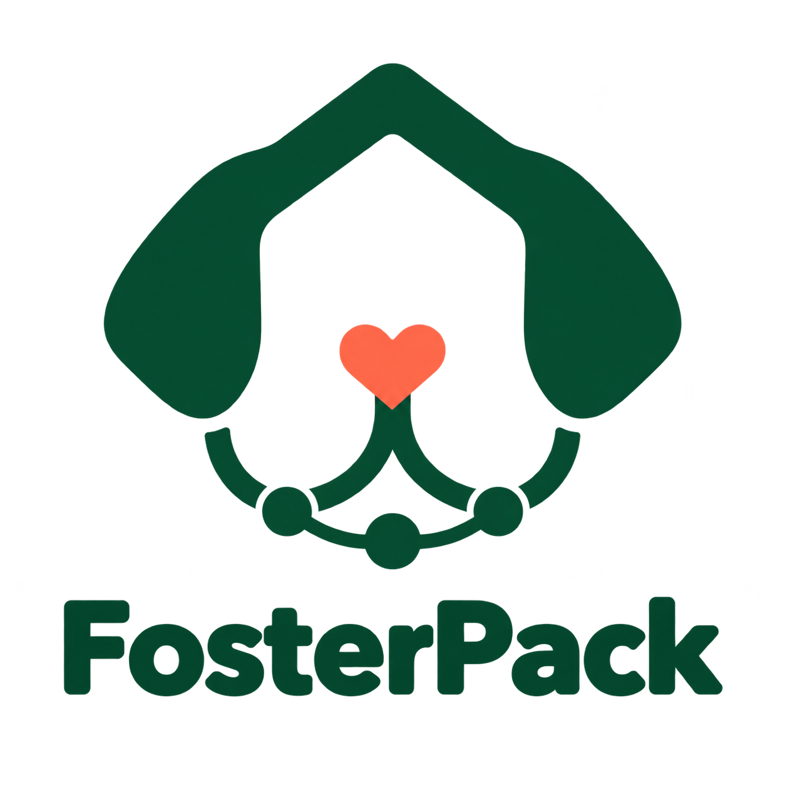

<p align="center">
  
</p>

# FosterPack-Dogathon-SF-2026
**Every foster has a pack.**

An AI-agent-powered incident-coordination portal for foster dog networks. One message from a foster caregiver becomes prioritized, assigned, trackable actions — walks, vet runs, medication, supplies, backup care — routed to volunteers, shelter staff, and vet teams automatically. Each dog carries a living profile — temperament, feeding, medical notes, quirks. AI coordinates; authorized humans decide.

## Design docs

Full product and engineering design lives in **[WOLFPACK.md](WOLFPACK.md)** (start here — it indexes everything below):

| Document | What it covers |
|---|---|
| [Product Requirements](docs/WolfPack-PRD.md) | Problem, personas, domain model, 12 feature areas, NFRs, risks, open questions |
| [Solution & Feature Breakdown](docs/WolfPack-Solution-Breakdown.md) | Architecture, tech stack, repo layout, 18 workstreams, shared contracts, testing |
| [Development Split by Persona](docs/WolfPack-Team-Split-By-Persona.md) | The same work split into 6 persona-aligned teams, with ownership seams |

> These docs use the working name **WolfPack**; the final product name is still unresolved.

## Getting started

The frontend lives in [`web/`](web) — Next.js (App Router) + TypeScript + Tailwind CSS.

Requires **Node 18.18+** (check [`web/.nvmrc`](web/.nvmrc); run `nvm use` inside `web/` if you use nvm).

```bash
cd web
npm install
npm run dev
```

Then open http://localhost:3000.

## Admin persona — the dog profile that writes itself

Implements the **T4 · Shelter Operations** slice of the
[persona split](docs/WolfPack-Team-Split-By-Persona.md#7-t4--shelter-operations-admin),
built around the WS-5 → AI-1 loop: *"flags inferred from journal entries,
proposed with evidence links. The profile writes itself."*

| Route | What it is |
|---|---|
| `/admin` | Exception-first operations home (F10.1) — dogs without a foster, overdue check-ins, health signals, past-due unclaimed tasks, long length of stay |
| `/admin/dogs` | Dog roster with live journal activity |
| `/admin/dogs/[id]` | **Dog profile** — stats, profile traits, proposals awaiting review, health signals, medical, and the journal timeline |

### How a journal entry reaches the profile

```
foster or volunteer logs an entry
        │
        ├─ objective stats update live      days in care, last check-in, entry counts
        │
        └─ rules engine finds a repeated signal
                 │
                 └─ proposes a trait + the entries that triggered it
                          │
                          └─ admin confirms  ──►  trait joins temperament / quirks
                             admin dismisses ──►  never proposed again
```

Both fosters (`/foster`) and volunteers (`/volunteer`) can log entries; volunteers
see the dogs they have scheduled tasks for. Entries are attributed to their author.

Three rules make this trustworthy rather than magic:

- **Nothing is auto-applied.** Inferred traits are suggestions an admin accepts or
  rejects — D10, *"AI drafts, humans decide."* Only counts and clocks update on their own.
- **Every proposal shows its evidence.** Each one lists the journal entries behind it,
  and a trait already on the profile is never re-proposed.
- **Thresholds, not single entries.** A signal must appear in at least two entries, so
  one unusual day never rewrites a dog's profile.
- **Private stays private.** Entries a foster marks private never reach the shelter
  view, the proposals, or the alerts.

Inference is deterministic keyword matching in
[`web/src/lib/insights.ts`](web/src/lib/insights.ts) — no model call — so any proposal
can be explained by pointing at the rule that produced it.

### Scope

Built: the operations home, dog roster, dog profile, and the journal→trait loop.

Not built, though real T4 includes them: intake and stray-hold clock, kennel/location
hierarchy, outcomes, Shelter Animals Count reporting, PetPoint migration, vaccination
series, audit log, and authentication. The current user for each view is a hard-coded
constant until sign-in exists.

> **Storage is the browser, not a server.** Journal entries and trait decisions live in
> `localStorage`, so they persist across reloads but are per-browser and are not shared
> between people. Replacing this with a real backend is the next step.

## Project status

Scaffolded so far: volunteer, foster-parent, and admin views over mock data — profile
directories, the dog profile with its dynamic journal loop, and the exception-first
operations home.
