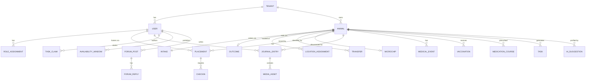
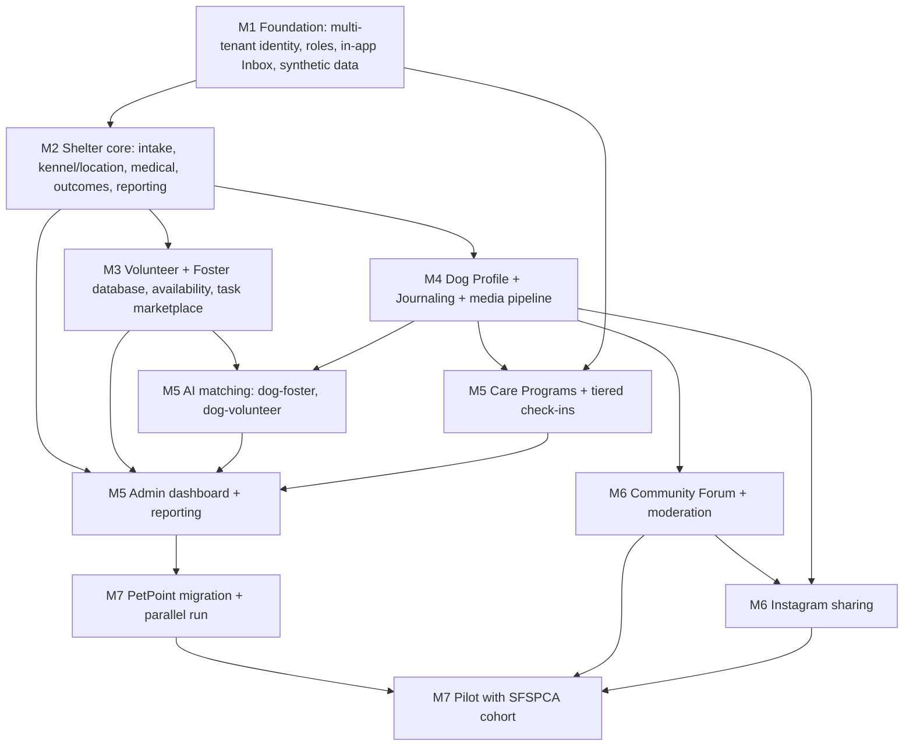

# WolfPack — Product Requirements Document

**Product:** WolfPack (working title; workspace folder is "The Foster Pack")
**Launch partner:** San Francisco SPCA (SFSPCA)
**Status:** Draft v0.1 — for review
**Owner:** TBD

---

## 1. Problem statement

Animal shelters run their foster and volunteer programs on a patchwork of tools that were never designed for the job. At SFSPCA, dog records live in **PetPoint**, veterinary records live in **EasyVet/ezyVet**, and the actual day-to-day coordination — who is fostering which dog, how that dog is doing this week, who can drive it to a vet appointment on Thursday — lives in spreadsheets, group texts, email threads, and staff members' heads.

This creates three compounding problems:

**P1 — There is no volunteer or foster database, so coordination is manual brokerage.** *(highest-impact gap)* Shelters have no queryable roster of who is available, what they're qualified for, how far they'll travel, or how reliable they've been. Every placement and every unscheduled vet run is routed by a human through group texts and memory. This is the single biggest operational bottleneck, and the clearest place WolfPack creates value.

**P2 — A dog's history is fragmented across systems that were never designed to hold it.** PetPoint is a *records* system, not a *care* system: it tracks intake and outcome but has nowhere to put what the foster actually sees — *she panics at skateboards, he settles instantly in a crate, she took three days to eat.* That behavioral narrative is the strongest predictor of adoption fit, and today it evaporates at every handoff. Splitting the official record from the lived record guarantees neither is complete.

**P3 — Institutional knowledge isn't shared.** A first-time foster whose dog starts sneezing at 9pm has no fast path to an answer. Experienced fosters, volunteers, and shelter staff collectively know the answer, but there's no place that connects them.

**Our bet:** the fragmentation in P2 is unsolvable while the official record lives in someone else's system. So WolfPack **replaces PetPoint** and becomes the shelter's system of record — then adds the volunteer/foster database and AI matching layer that no system provides today, with journaling as the mechanism that keeps the record current.

### 1.1 System-of-record map

| System | Status | Owns |
|---|---|---|
| **WolfPack** | **System of record** | Animal records, intake & outcomes, kennel/location, shelter medical & vaccination, microchip, transfers, adoptions, regulatory reporting — **plus** the volunteer/foster database, availability, tasks, AI matching, placements, behavioral journal, community forum |
| **PetPoint** | **Replaced** | Nothing going forward. A one-time historical migration is required at cutover (F11.9). |
| **EasyVet / ezyVet** | **External, integrated later** | Community-clinic veterinary care delivered outside the shelter. Stays third-party; WolfPack reads it in a future integration (§14). |

> **Consequence:** WolfPack now carries system-of-record obligations — data durability, auditability, statutory records retention, and regulatory reporting. These are not optional features; they are the price of replacing PetPoint. See F11.8, §9, and R15–R17.

---

## 2. Goals and non-goals

### Goals
*(ordered by expected impact)*
1. **Replace PetPoint with a shelter management system built for how shelters actually work** — intake through outcome in one place, with the official record and the care record unified rather than split across tools.
2. **Build the volunteer and foster database that doesn't exist today** — searchable, current, with skills, certifications, availability, travel radius, capacity, and reliability history.
3. **Match dogs to fosters and volunteers with AI** — lifestyle↔needs compatibility, explained in plain language, decided by a human.
4. Give volunteers a self-serve way to publish availability and claim/release tasks, so coordinators stop brokering every request.
5. Cut coordinator hours per fostered dog by automating scheduling, check-ins, and routing.
6. Build the behavioral journal that makes a dog's profile materially richer at adoption time than anything available today.
7. Make fostering approachable for first-timers via an experience-tiered onboarding program, without burying experienced fosters in busywork.
8. Build a public community forum that turns individual foster experience into shared knowledge, with organic reach via Instagram.

### Non-goals for this release
- **Replacing EasyVet.** Community-clinic veterinary care stays in EasyVet; WolfPack integrates with it later (§14). WolfPack *does* own shelter-delivered medical care.
- **Building a veterinary EMR.** WolfPack records medical events, orders, and vaccination history. It is not a clinical practice-management system.
- Foster/adoption **applications** and approval workflow (explicitly deferred — see §14).
- Donations, fundraising, or payment processing.
- Medical record authoring. WolfPack records *observations*, not diagnoses or treatment orders.
- Cats and other species (data model must not preclude them — see §6).

---

## 3. Scope decisions (confirmed)

| # | Decision | Rationale / consequence |
|---|---|---|
| D1 | **Native mobile (iOS + Android) for fosters & volunteers; web dashboard for admins.** | Journaling depends on camera/mic/offline capture. Admin work is multi-pane and desk-based. |
| D2 | **WolfPack replaces PetPoint.** No PetPoint integration. WolfPack becomes the shelter system of record: intake, kennel/location, medical & vaccination, outcomes, transfers, microchip, regulatory reporting (§8.11). Development runs on **generated synthetic data**. | Removes an external dependency and, more importantly, removes the fragmentation that makes P2 unsolvable. Requires a one-time historical migration at cutover (F11.9) and brings real records-integrity obligations. |
| D3 | **Full scope is v1** — nothing is deferred to a later release except items in §14. | Sequencing in §15 is dependency ordering, not scope cutting. |
| D4 | **Matchmaking is AI-powered but human-decided.** Three layers: deterministic hard constraints → compatibility scoring → LLM reasoning & explanation. Covers **Dog↔Foster** and **Dog↔Volunteer**. | Lifestyle↔needs fit is nuanced and is where AI adds genuine value. But safety constraints stay in code and final authority stays human. |
| D5 | **Community Forum is fully public to read, and cross-tenant.** Any foster (from any shelter on the platform), volunteer, or admin can post. | Maximizes reach and knowledge pooling. Creates significant moderation, liability, and PII obligations — see §12. |
| D6 | **Multi-tenant from day 1.** SFSPCA is tenant #1. | Avoids a rewrite. Note the forum deliberately spans tenants while all operational data is tenant-isolated. |
| D7 | **In-app notifications are the primary channel — quiet by default.** An in-app inbox carries everything; push is rare and reserved for genuine urgency; email is opt-in digest only. **No SMS in v1.** | Explicit user directive: minimize disturbance. Over-notification is the top churn risk, especially for experienced fosters. |
| D8 | **Dogs only in v1; data model is species-agnostic.** | Cats can be enabled later without migration. |
| D9 | **The record is dynamic and AI-augmented throughout** (§8.12) — not a digital filing cabinet. Fifteen AI capabilities spanning intake, health, matching, search, and reporting. | The value of replacing PetPoint is not a nicer form UI; it's a record that maintains itself and surfaces what needs attention. |
| D10 | **AI drafts, humans decide.** Every AI output is an evidence-linked suggestion with accept/reject/edit; nothing writes authoritatively without confirmation; every capability has a non-AI fallback. | We are a system of record now. It cannot depend on a model being up or being right. |

---

## 4. Success metrics

**Primary — volunteer/foster database & matching (the core bet)**

| Metric | Definition | Target direction |
|---|---|---|
| **Volunteer task fill rate** | % of published tasks claimed before deadline | ↑ 90%+ |
| **Time-to-fill** | Median hours from task published → claimed | ↓ |
| **Coordinator hours per fostered dog** | Staff time logged on placement + coordination ÷ dogs placed | ↓ 40% vs. baseline |
| **Time-to-place** | Hours from "foster needed" → "dog in home" | ↓ |
| **Match acceptance rate** | % of system-suggested matches an admin accepts without override | ↑ |
| **Roster currency** | % of registered volunteers/fosters with up-to-date availability on file | ↑ 80%+ |

**Secondary — journaling, retention, community**

| Metric | Definition | Target direction |
|---|---|---|
| **Journaling adoption** | % of active fosters posting ≥ 3 entries/week | ↑ |
| **Profile completeness at adoption** | % of dogs with ≥ N journal entries across ≥ 2 author roles | ↑ 80%+ |
| **Check-in compliance** | % of required check-ins completed on time, by foster tier | ↑ (Beginner ≥ 85%) |
| **Foster retention** | % of fosters who take a 2nd placement within 90 days | ↑ |
| **Failed placement rate** | % of placements returned early | ↓ |
| **Length of stay (LOS)** | Days from intake to adoption | ↓ |
| **Time-to-first-answer (forum)** | Median minutes from post to first substantive reply | < 2 hours |
| **Push opt-out rate** | % of users who disable push notifications | Watch — a rise means we're being disruptive |

**Shelter operations (system-of-record)**

| Metric | Definition | Target direction |
|---|---|---|
| **Live release rate** | Live outcomes ÷ total outcomes | ↑ |
| **Capacity utilization** | Occupied ÷ available kennel capacity | Stable, no sustained overcrowding |
| **Record completeness** | % of animals with intake, medical, microchip, and outcome fully populated | ↑ 95%+ |
| **Data entry time per intake** | Minutes from animal arrival to record complete | ↓ (AI-assisted intake should move this materially) |
| **Reporting turnaround** | Time to produce the monthly SAC submission | ↓ to near-zero (auto-generated) |

**AI health (§8.12)**

| Metric | Definition | Target direction |
|---|---|---|
| **Suggestion acceptance rate** | Per capability: accepted ÷ (accepted + rejected) | ↑ — sustained < 50% triggers the kill switch (F12.7) |
| **Early-warning precision** | % of health/placement-risk flags a human confirms as real | ↑ — false alarms destroy trust fast |
| **AI-assisted profile coverage** | % of behavioral flags originating from AI suggestion vs. manual entry | ↑ (the profile writing itself) |
| **Inference cost per tenant** | Monthly spend | Within cap (F12.6) |
| **Fallback rate** | % of requests served by the non-AI path | ↓, and always non-fatal |

Baselines to be captured from SFSPCA before launch.

---

## 5. Personas

### 5.1 Foster — Beginner (Tier 1)
First or second placement. Enthusiastic, anxious, unsure what's normal. Needs to be told what to do and when, and needs reassurance that a wobbly first 72 hours is expected. Will churn if they feel abandoned — or if the app nags them in ways that feel bureaucratic.

### 5.2 Foster — Intermediate (Tier 2)
Several placements. Knows the basics. Wants milestone-based structure, not hand-holding. Will take moderately complex cases.

### 5.3 Foster — Experienced (Tier 3)
Long-tenured; takes medical, behavioral, neonate, or hospice cases. **Over-notification is the primary churn risk.** Wants exception-based contact only, plus the ability to log fast and move on.

### 5.4 Volunteer
Time-constrained, wants to help concretely. Needs to publish real availability once and then see what fits it. Frustrated by "can anyone do X?" broadcast texts.

### 5.5 Shelter Admin / Foster Coordinator
Manages dozens of dogs and hundreds of people. Lives in the web dashboard. Needs exceptions surfaced, not a firehose. Ultimate decision-maker on placements.

### 5.6 Veterinarian / Vet Tech (light-touch role)
Not a primary user. Needs to read a dog's foster-observed history before an appointment and append a short visit summary. Should not be asked to learn a new EMR.

---

## 6. Domain model (conceptual)

**Key entities**

- **Tenant** — a shelter organization. All operational data is tenant-scoped. *Exception:* forum content is global.
- **Animal** — species-agnostic (`species` enum, dogs only enabled in v1). Carries identity, physical attributes, behavioral flags, care requirements, and a computed **residency clock** (days in shelter, days in current foster, cumulative days in system).
- **Placement** — a time-bounded stay of an Animal with a Foster. Has a type (`foster`, `foster-to-adopt`, `respite`, `medical-hold`, `hospice`), start/end, and outcome.
- **JournalEntry** — the atomic unit of history. Authored by any role. Typed (see §8.3). Immutable once posted; corrections are appended, never overwritten.
- **MediaAsset** — image / video / audio, with transcription for audio+video, and EXIF/geolocation stripped on ingest.
- **MedicalEvent** — exam, procedure, treatment, diagnostic. Structured, distinct from journal observations.
- **Vaccination / MedicationCourse** — series-tracked vaccinations with due dates; medication courses that generate foster reminders and adherence tracking (F11.3).
- **Intake / Outcome** — the bookends of an animal's stay. Intake starts the residency clock and captures how the animal entered; Outcome closes it and finalizes the custody chain (F11.1, F11.5).
- **LocationAssignment** — where the animal is *right now*, plus full movement history. **Foster home is a location type**, so the custody chain is continuous on-site and off-site (F11.2).
- **Microchip** — chip number, registry, registration status, transfer-to-adopter state (F11.4).
- **Transfer** — transfer-in/out with a partner organization (F11.6).
- **AISuggestion** — every AI output persisted with its evidence links, confidence band, model + prompt version, and accept/reject/edit state. Suggestions are first-class records, not ephemeral UI (F12.1).
- **Task** — a unit of volunteer work (see §8.5), with category, time window, location, required skills, and claim state.
- **AvailabilityWindow** — a volunteer's recurring or one-off availability.
- **CheckIn** — a scheduled prompt tied to a Placement and driven by the foster's tier program.
- **ForumPost / ForumReply** — global, cross-tenant, publicly readable.

**Residency clock (P2 requirement).** Every Animal exposes: total days in system, days at shelter facility, days in foster (current + cumulative), number of distinct placements, and full chronological custody chain. This is a first-class, always-visible field — not something to be reconstructed from records.

---

## 7. Experience principles

These are binding design constraints, not aspirations. Assume every user is non-technical, often stressed, and frequently one-handed while holding a dog.

1. **Plain language.** Target ~6th-grade reading level. No shelter jargon in foster-facing UI without a tap-to-explain.
2. **One primary action per screen.** The "log something" button is always reachable in one tap from anywhere.
3. **Capture first, categorize later.** A foster can shoot a video and post it with zero required fields. The system prompts for structure afterward, optionally.
4. **Offline-first.** Journaling must work with no connectivity. Media queues and uploads resumably when signal returns. This is non-negotiable — foster homes have dead zones and video files are large.
5. **Never lose a capture.** Drafts and media survive app kill, phone restart, and failed upload.
6. **Accessibility.** WCAG 2.2 AA. Large tap targets, high contrast, full VoiceOver/TalkBack support, voice-to-text everywhere text is accepted.
7. **Localization.** English at launch; Spanish and Traditional Chinese required for SF before GA.
8. **Quiet by default.** WolfPack pulls; it does not push. The in-app inbox is the primary surface, and interrupting the user is the exception — governed by explicit policy (§8.9) with a hard daily cap. The product must be fully usable with push turned off entirely.

---

## 8. Feature specifications

### 8.1 Identity, roles, and multi-tenancy

**F1.1** A user has a single account and may hold multiple roles across multiple tenants (e.g., foster at SFSPCA, volunteer at another shelter).

**F1.2** Roles: `foster`, `volunteer`, `shelter_admin`, `vet` (light-touch), `platform_admin`.

**F1.3** Admins invite users by email or SMS link. **No self-serve signup for operational roles in v1** — shelters control who fosters. Forum-only accounts may self-register (see §8.7).

**F1.4** Authentication: passwordless (email magic link, with SMS OTP as an alternative) because password management is a real barrier for this audience. Optional passkey support.

> **SMS boundary.** SMS is used *only* for user-initiated authentication and admin-issued invitations. It is **never** a notification channel (§8.9, F9.3). A user can complete their entire WolfPack experience without receiving a single unsolicited text.

**F1.5** Tenant isolation is enforced at the data layer. A user's queries are scoped to tenants where they hold an active role. Forum content is explicitly exempt and lives in a global scope.

**F1.6** Foster experience tier (`beginner` / `intermediate` / `experienced`) is an attribute of the foster's tenant-scoped profile. Admins can override it. The system proposes promotions based on completed placements and outcomes; **promotion is never automatic.**

---

### 8.2 Tiered foster onboarding and check-in programs

The onboarding program is the mechanism that makes first-time fostering survivable and keeps experienced fosters from quitting.

**F2.1 — Program templates.** A **Care Program** is a template of scheduled prompts, educational content, and required check-ins, bound to (foster tier × placement type). Shelter admins can edit templates and create new ones; they are tenant-scoped and versioned.

**F2.2 — Beginner program (default: 14 days).**
- **Pre-arrival:** supply checklist, home prep walkthrough, short video modules, "what the first 72 hours look like" expectation-setting.
- **Days 1–3:** daily check-ins. Explicit decompression guidance. Prompts framed as reassurance, not compliance ("Lots of dogs won't eat the first day. Did she eat today?").
- **Days 4–7:** daily, lighter.
- **Days 8–14:** every other day.
- **Post-14:** graduates to Intermediate cadence for the remainder of the placement.
- **Mentor pairing:** every beginner is assigned an experienced-foster buddy with in-app direct messaging.
- **Milestones:** first meal, first night, first walk, first vet visit, settling markers — celebrated, shareable.

**F2.3 — Intermediate program.** Weekly check-in + milestone-triggered prompts. Educational content available on demand rather than pushed.

**F2.4 — Experienced program.** Minimum viable: one weekly entry (photo + weight + freeform note). Everything else is exception-driven. Medical/behavioral cases may add condition-specific prompts (e.g., a medication schedule adds dose confirmations) — these are the only additional required interactions.

**F2.5 — Check-in structure.** A check-in is a small set of tap-first questions (appetite, energy, elimination, mood, anything worrying?) plus optional media. Target completion time: **under 30 seconds.** Every check-in produces a JournalEntry.

**F2.6 — Missed check-in escalation.** Missed check-ins escalate on a tier-aware schedule: in-app reminder → second in-app reminder with badge → **coordinator is alerted in the admin dashboard and reaches out personally.** Beginners escalate to a human faster than experienced fosters. Escalation surfaces the problem to staff rather than escalating pressure on the foster — the app does not nag.

**F2.7 — Concern escalation.** Any check-in or journal entry can be flagged **"Something's wrong."** This immediately: creates a high-priority item in the admin dashboard, sends the on-call coordinator an urgent push, and offers the foster a triage path — guidance article, forum post, message coordinator, or emergency vet contact. Emergency vet contact info must be reachable in ≤ 2 taps from anywhere in the app.

---

### 8.3 Journaling

The single most important feature. If journaling fails, the product fails.

**F3.1 — Entry types.** `note`, `photo`, `video`, `audio`, `weight`, `meal`, `elimination`, `medication_given`, `behavior_observation`, `milestone`, `concern`, `vet_visit_summary`.

**F3.2 — Zero-friction capture.** A persistent capture button. Record video/audio or shoot a photo and post with no required metadata. Type inference and prompted enrichment happen after the fact.

**F3.3 — Voice-first.** Audio entries are auto-transcribed. Transcripts are searchable and become part of the dog's text history. Fosters can dictate rather than type anywhere.

**F3.4 — Offline & resumable.** Entries and media are written locally first, queued, and uploaded resumably. Clear per-entry sync state. No silent data loss.

**F3.5 — Multi-author timeline.** Fosters, volunteers, vets, and shelter staff all write to the same Animal timeline, visually attributed by role. This is the mechanism that solves P2.

**F3.6 — Append-only.** Entries are immutable after a short edit window. Corrections append a linked correction entry. History must be trustworthy.

**F3.7 — Structured extraction.** Where possible, structured data is extracted from unstructured entries (a weight mentioned in a voice note populates the weight series; a photo is auto-tagged). Extraction is always **suggested and confirmable**, never silently authoritative.

**F3.8 — Privacy controls.** Each entry carries a visibility setting: `shelter-only` (default), `shareable` (eligible for adoption profile), `public` (eligible for forum/Instagram). Media is stripped of EXIF/geolocation on ingest, unconditionally.

**F3.9 — Prompted journaling.** The program schedule (§8.2) generates gentle, specific prompts ("It's day 3 — how's she doing with the crate?") rather than a blank box. Blank boxes are where journaling initiatives die.

---

### 8.4 Dog profile

**F4.1 — Composite profile.** A single Animal view assembling: identity & photos, physical attributes, **residency clock**, current placement & custody chain, medical history, behavioral profile, care requirements, adoption history, and the full journal timeline.

**F4.2 — Behavioral profile.** Structured, evidence-linked flags: house-trained, crate-trained, leash skills, separation anxiety, resource guarding, reactivity (triggers), sociability with dogs/cats/kids/strangers, noise sensitivity, energy level. **Every flag links to the journal entries that evidence it** — no unsourced assertions.

**F4.3 — Timeline view.** Chronological, filterable by author role, entry type, and date. Media-rich. This is the primary "get to know this dog" surface.

**F4.4 — Weight & health trends.** Charted weight over time; medication adherence; vaccination status.

**F4.5 — Adoption profile generation.** One-click generation of an adopter-facing summary drawn from the journal — a real, specific portrait instead of a generic blurb. Admin reviews and edits before publishing. Only `shareable`/`public` entries are eligible.

**F4.6 — Role-based redaction.** Volunteers see care-relevant info; adopters see the curated profile; admins see everything. Foster home addresses are never visible to non-admins.

---

### 8.5 Volunteer availability and task marketplace

**F5.1 — Availability publishing.** Volunteers set recurring weekly availability plus one-off exceptions, a travel radius, and whether they have a vehicle. Set once, adjust rarely.

**F5.2 — Skills & certifications.** Transport, medication administration, dog walking, photography, laundry/supply runs, home checks, event support, behavior support. Some are admin-verified.

**F5.3 — Task categories** (from problem statement, extended):
- **Unscheduled vet visits** — transport + accompaniment to non-routine appointments
- **Pet supply deliveries** — food, crates, meds to foster homes
- **Transport** — shelter ↔ foster, foster ↔ foster
- **Foster respite / sitting** — short-term cover
- **Photography** — adoption listing photos/video
- **Home checks**
- **Event support**
- **Ad-hoc** — admin-defined

**F5.4 — Upcoming tasks feed.** Volunteers see a categorized, filterable feed. Default view is **tasks that fit their published availability and radius** — not the full firehose.

**F5.5 — Vote in / vote out.** One-tap **claim** and **release**. Releasing requires a reason and triggers automatic backfill: the task republishes and notifies matching volunteers. Releases inside a configurable urgency threshold (e.g., < 12 hours) escalate directly to a coordinator.

**F5.6 — Reliability signal.** Claim/completion/late-release history is tracked and visible to admins. Used as a matchmaking input. Surfaced to the volunteer as encouragement, never as a punitive score.

**F5.7 — Task lifecycle.** `draft → published → claimed → in_progress → completed → verified`. Completion can require proof (photo, signature, note) per task type. Completed transport/vet tasks auto-generate a JournalEntry on the Animal.

**F5.8 — Calendar.** Personal calendar view + iCal/Google Calendar subscription feed.

---

### 8.6 AI-powered matchmaking (admin)

Matching is where AI earns its place in this product. Lifestyle↔needs compatibility is genuinely nuanced, high-stakes, and exactly the kind of judgment that is tedious for humans at scale but explainable when done well.

**Worked example (the target behavior):** a single person in a studio apartment, in the office two days a week, should surface **small, independent, lower-energy or senior dogs** — and should *not* surface a high-energy young dog, a dog with separation anxiety, or a dog that needs yard access. The system must reach that conclusion on its own and **say why in plain language**.

#### F6.1 — Two matchers
- **Dog ↔ Foster** — who should foster this dog
- **Dog ↔ Volunteer** — which volunteers should work with this dog (walking, transport, handling, socialization, medical accompaniment). Distinct from task assignment, which is a scheduling problem; this is a *compatibility* problem.

#### F6.2 — Three-layer engine

| Layer | Method | Responsibility |
|---|---|---|
| **1. Hard constraint filter** | **Deterministic rules. Never a model.** | Safety and legality. Eliminates impossible matches outright. |
| **2. Compatibility scoring** | Structured ML / weighted heuristics | Scores lifestyle↔needs fit across dimensions in F6.4/F6.5 |
| **3. Reasoning & explanation** | **LLM over the dog's journal history + foster/volunteer profile** | Nuanced fit assessment and plain-language rationale a coordinator can repeat verbatim to a foster |

Separating these layers is deliberate: **the model may rank and explain, but it may never decide what is safe.** Hard constraints stay in code.

#### F6.3 — Explainability is a hard requirement
Every candidate returns structured `positiveFactors[]`, `negativeFactors[]`, `blockers[]`, and a confidence band — rendered in plain language, each **citing its evidence** (a journal entry, a profile field, an outcome). No bare numeric scores in the UI. If the system can't explain a suggestion, it doesn't make it.

#### F6.4 — Dog↔Foster dimensions

*Hard constraints (blockers):* species/size limits, no-other-pets requirements, kid-age restrictions, isolation/quarantine needs, medication-administration capability, yard requirement, landlord/building pet rules, max hours-alone tolerance.

*Foster lifestyle signals:*
- **Housing** — studio / apartment / house, square footage, stairs, yard (fenced / unfenced / none), building pet rules, neighbor noise sensitivity
- **Schedule** — WFH vs. in-office days, typical hours away per day, travel frequency, flexibility for daytime vet visits
- **Household** — adults, children and ages, other pets (species, size, temperament), allergies
- **Activity level** — sedentary → very active; runner/hiker; walk frequency and duration
- **Experience** — tier, dog types previously handled, medication comfort, behavior-modification skill
- **Preferences and explicit dealbreakers**
- **Logistics** — vehicle, proximity to shelter and vet

*Dog need signals:*
- Size, weight, age band, energy level, **independence vs. "velcro"**, daily exercise requirement
- **Alone-tolerance** — the decisive signal for anyone with office days
- Vocalization level (decisive for apartments and shared walls)
- House-trained, crate-trained
- Medical complexity and medication cadence
- Behavioral profile: separation anxiety, reactivity triggers, resource guarding, sociability with dogs/cats/kids/strangers, noise sensitivity
- Handling difficulty — leash strength and handler skill required
- Special categories: neonate, hospice, quarantine, bite history

#### F6.5 — Dog↔Volunteer dimensions
- **Handling capability vs. the dog's handling difficulty** — a 90lb reactive dog requires a strong, experienced handler; this is a safety matter, not a preference
- **Temperament fit** — a calm, quiet volunteer for a fearful dog; a high-energy volunteer for a dog that needs real exercise
- **Continuity** — prior relationship with this dog is a strong positive signal; dogs benefit enormously from familiar handlers
- Required certifications for medical or behavioral cases
- Availability overlap with the dog's care cadence
- Physical capability, vehicle, travel radius
- Reliability history

#### F6.6 — Human decision is mandatory
The system never assigns. An admin reviews, optionally overrides, and confirms. **Override reasons are captured** and become training signal.

#### F6.7 — Fairness, bias, and safety guardrails
Non-negotiable, because this system makes consequential recommendations about people:
- **Protected characteristics are never inputs.** The model must not use or infer race, religion, national origin, disability, familial status, sexual orientation, or age of the foster. Household composition is used only where it is a genuine animal-welfare factor (e.g., a dog with a bite history and a toddler in the home).
- **Distribution audit.** Periodic review that suggestions aren't systematically concentrating on or excluding groups of fosters.
- **Load balancing** (burnout risk): current load and recent-placement recency are explicit dampening factors so a handful of high-performing fosters aren't over-suggested.
- **Deterministic fallback.** If the LLM layer is unavailable, the system degrades to layers 1–2 and says so. It never fails closed on placement.
- **Full audit trail.** Model version, prompt version, inputs, and output retained for every suggestion (F10.8).
- **No PII to third-party models** without an executed data-processing agreement; prefer a self-hosted or enterprise-tier model. Foster addresses and contact details are never sent to a model.

#### F6.8 — Learning loop
- Override reasons and **placement outcomes** (successful adoption, early return, failed placement, foster burnout) feed model improvement.
- Outcomes are weighted more heavily than acceptances: a match that produced a successful adoption is a far stronger signal than one an admin merely clicked through.
- Model changes ship behind a flag and are evaluated against a held-out set of historical placements before rollout.

#### F6.9 — Bulk triage
For intake surges: a board view ranking many dogs against many fosters at once, with the same explainability guarantees.

#### F6.10 — Transparency to fosters and volunteers
Anyone offered a match sees why they were chosen, in the same plain language. Offers can be declined **without penalty**; decline reasons improve future matching.

---

### 8.7 Community forum

**F7.1 — Visibility model.** **Publicly readable without an account** (SEO and reach are the point). **Posting requires an authenticated account.** Fosters, volunteers, and admins from *any* tenant may post — the forum is a single global community, deliberately spanning tenants.

**F7.2 — Forum-only accounts.** Members of the public may self-register for a `community_member` role: can post and reply, cannot see any operational data. Requires email verification. New accounts are rate-limited and first posts go through a review queue until trust is established.

**F7.3 — Structure.** Categories (Medical & Health, Behavior & Training, Puppies & Neonates, Seniors & Hospice, Supplies & Logistics, Adoption Stories, Shelter-Specific). Tags, full-text search, and "similar questions" surfaced *before* posting to reduce duplicates.

**F7.4 — Question workflow.** Posts can be marked as questions, replies can be marked helpful, and the original poster can accept an answer. Urgent questions are visually distinct and can notify opted-in experienced fosters and staff.

**F7.5 — Role badges.** Author role is visible (Experienced Foster, Shelter Staff, Veterinarian, Volunteer). Verified vet/staff badges are admin-granted. Trust signals matter enormously when the topic is medical.

**F7.6 — Medical guardrails (mandatory).**
- Posts in medical categories render a persistent, non-dismissible disclaimer: community advice is not veterinary care.
- Keyword-based **emergency interception**: symptoms indicating a genuine emergency (bloat, seizure, ingested toxin, difficulty breathing, uncontrolled bleeding, collapse, parvo signs) trigger an interstitial urging immediate veterinary contact, with the poster's local emergency vet info, *before* the post is published.
- If the poster is an active foster, an emergency-flagged post **also alerts their shelter coordinator.**

**F7.7 — Moderation.** Given D5 (fully public), this requires real investment:
- Automated screening on submission (spam, abuse, PII, animal-cruelty content).
- Peer flagging + prioritized moderator queue.
- Designated moderators (platform + per-tenant staff) with remove/lock/ban tooling.
- **Automatic PII scrubbing** — the system detects and blocks street addresses, phone numbers, and foster home identifiers before publication. This protects foster safety and is non-optional.
- Published moderation policy and appeals path.

**F7.8 — Journal → forum.** A foster can promote a journal entry into a forum question in one tap, carrying its media. The visibility gate (§8.3, F3.8) applies: promotion forces the entry to `public` and requires explicit confirmation.

---

### 8.8 Instagram sharing

**F8.1 — Shareable sources.** Journal entries (a cute moment, a milestone) and forum posts.

**F8.2 — Technical reality.** Instagram's Graph API supports programmatic publishing **only to Business/Creator accounts** that have completed app review, and does not support posting to arbitrary personal accounts. Therefore two distinct paths:

- **Path A — Personal accounts (the common case).** WolfPack renders a branded, correctly-sized image or video (1:1 / 4:5 / 9:16 Story), copies a pre-written caption + hashtags to the clipboard, and hands off to the native OS share sheet / Instagram app. The user completes the post in Instagram. This works for everyone and requires no Meta approval.
- **Path B — Shelter accounts.** Tenants may connect an official Instagram Business account via Graph API for direct, staff-approved publishing from the admin dashboard.

**F8.3 — Consent and safety gate.** Sharing is blocked unless: the foster has granted media-sharing consent for that placement, the entry is marked `public`, EXIF/geolocation is stripped (always), and no foster home identifiers are visible. Shelter admins may require approval before any share referencing their dogs.

**F8.4 — Attribution.** Shared assets carry shelter branding, the dog's name, and adoption status/link where applicable — the point is adoption reach, not vanity metrics.

**F8.5 — Extensibility.** The share pipeline should be channel-agnostic so Facebook, TikTok, and X can be added without rework.

---

### 8.9 Notifications — quiet by default

**Design stance:** WolfPack is a **pull** product, not a push product. The baseline assumption is that the user opens the app and finds what's waiting for them. Interrupting them is the exception and has to be justified.

**F9.1 — The in-app Inbox is the primary channel.** Every notification lands in a single in-app Inbox with a badge count. Nothing else is required for the product to function. The Inbox is durable: if an interruptive channel fails or is disabled, the item is still there.

**F9.2 — Channel policy.**
| Class | Examples | Delivery |
|---|---|---|
| **Urgent** (deliberately rare) | Concern flag raised on a dog you're responsible for; emergency task unclaimed near deadline; medication dose missed | In-app **+ a single push**. Governed by an explicit allow-list of event types that does not grow without product sign-off. |
| **Actionable** | Check-in due, task starting soon, match offer awaiting response | In-app only, with badge. Optionally included in the opt-in digest. |
| **Informational** | Forum reply, milestone celebration, new task matching your availability | In-app only. Never interrupts. |

**F9.3 — No SMS in v1.** Removed on purpose. It is the most disruptive channel, carries per-message cost, and is inappropriate for a volunteer audience giving their time.

**F9.4 — Email is opt-in digest only.** A single daily or weekly summary the user chooses. Transactional email is limited to account and security messages. There is no per-event email.

**F9.5 — Tier-aware in-app cadence.** Beginner fosters see more frequent prompts in their Inbox; experienced fosters see exception-only. This modulates *how much is waiting in the Inbox*, not how often the phone buzzes.

**F9.6 — Hard caps and quiet hours.** A hard daily cap on interruptive notifications per user. User-configured quiet hours are respected by every class, including Urgent, except for a very short list of genuine animal-welfare emergencies that is disclosed explicitly at onboarding.

**F9.7 — Push is fully optional.** A user can disable push entirely and rely solely on the Inbox, and the product must remain fully usable. This is a design requirement, not a degraded mode.

**F9.8 — Coordinator-mediated escalation.** When something needs a response and the user isn't reacting, WolfPack alerts the **coordinator** in the admin dashboard rather than escalating pressure on the foster or volunteer. People chase people.

**F9.9 — Read accounting.** Read state is tracked so escalation (§8.2, F2.6) acts on genuine non-receipt rather than assumption.

---

### 8.10 Admin dashboard (web)

**F10.1 — Operations home.** Exception-first: dogs without fosters, overdue check-ins, raised concerns, unclaimed urgent tasks, placements ending soon, dogs exceeding LOS thresholds.

**F10.2 — Roster management.** Animals, fosters, volunteers — with search, filters, saved views, and bulk actions.

**F10.3 — Placement management.** Create, extend, transfer, and close placements; record outcomes.

**F10.4 — Task authoring.** Create tasks manually or from templates; auto-generate recurring tasks (e.g., weekly supply runs).

**F10.5 — Program editor.** Create and version Care Program templates without engineering involvement.

**F10.6 — Moderation console.** Forum queue, flags, PII detections, bans.

**F10.7 — Reporting.** Metrics from §4, exportable to CSV. Designed to feed shelter board reporting and Shelter Animals Count submissions.

**F10.8 — Audit log.** Every consequential action (placement change, profile edit, media deletion, role grant) is attributed and immutable.

---

### 8.11 Shelter management core — a living record

This is what replaces PetPoint, and it is the substrate §8.4, §8.6, and §8.10 sit on.

> **The framing that matters:** PetPoint is a filing cabinet — staff type things into it, and it's only as current as the last person who remembered to update it. WolfPack is a **living record**: it updates itself from care activity, notices patterns, and tells you when something needs attention. That difference *is* the product.

#### F11.1 — Intake (AI-assisted)
- Intake types: stray, owner surrender, transfer-in, born-in-care, post-adoption return, confiscation/seizure, public assist
- Capture: date/time, source, surrendering/finding party, location found, condition on arrival, intake photo, initial weight, apparent age/breed/sex, first temperament impression
- **Smart intake:** intake photo → breed / age / sex / weight estimates offered as **suggestions**; **OCR** of surrender forms and incoming vet records into structured fields; microchip scan auto-matches prior records; **duplicate and return detection** on intake
- Litter intake: bulk create with linked siblings
- **Stray hold clock** — jurisdiction-configurable hold period with a visible countdown to disposition eligibility
- Intake starts the residency clock (§6)

#### F11.2 — Kennel & location tracking (forecasting)
- Location hierarchy: building → room/ward → kennel/run/cage
- Location states: available, occupied, cleaning, out-of-service, quarantine/isolation
- Current location + full movement history with timestamps and reasons
- **Foster home is a location type.** The custody chain is continuous whether the dog is on-site or in a foster home — this unification is precisely what a separate foster tool can never give you.
- Isolation/quarantine ward tracking for contagious cases
- **Capacity forecasting:** projected occupancy from historical intake patterns, seasonality, and the current pipeline — flags projected overcrowding early enough to act (transfer partners, foster recruitment pushes)
- **Smart kennel assignment:** suggests placement based on temperament, medical status, and neighbors (e.g., keep a noise-sensitive dog away from the intake ward)

#### F11.3 — Medical & vaccination records (with early warning)
- Structured events: exam, vaccination, procedure/surgery, diagnostic, treatment, spay/neuter, euthanasia
- Vaccination schedules with series tracking (e.g., DHPP), due dates, automatic overdue flagging
- Medication courses (drug, dose, route, frequency, start/end, prescriber) → **generate foster medication reminders and adherence tracking** (F2.4)
- Weight series with trend charting
- **Health-trend anomaly detection:** weight-loss trajectory, declining appetite across journal entries, medication non-adherence, repeated symptom mentions → flagged to staff **before it becomes a crisis**. This is the clearest example of journaling paying dividends back into the medical record.
- **Symptom triage assist:** a concern flag (F2.7) receives a severity assessment and recommended urgency. **Advisory only — never a diagnosis** (F12.5).
- Medical alerts surface prominently on the profile and feed matching hard constraints (F6.4)
- Spay/neuter status with required-before-adoption gating
- **Scope boundary:** WolfPack records medical *events and orders*. It is not a clinical EMR; community-clinic care stays in EasyVet (§1.1).

#### F11.4 — Microchip & identification
- Chip number, brand, implant date, registry; registration status and **transfer-to-adopter workflow**
- Scan-on-intake with lookup against prior records
- Alternate IDs: rabies tag, license number, tattoo

#### F11.5 — Outcomes
- Types: adoption, return-to-owner, transfer-out, euthanasia, died-in-care, missing, released
- Adoption record: adopter details, date, fee, contract, follow-up schedule
- Return-to-owner: proof of ownership, reclaim fee
- Euthanasia: reason category, authorization, required approvals — **deliberately audit-heavy**
- Outcome closes the residency clock and finalizes the custody chain

#### F11.6 — Transfers
- Transfer-in / transfer-out with a partner-organization registry
- Batch transfers (common with rescue partners)
- Records travel with the animal when the receiving org is also on WolfPack

#### F11.7 — Reporting (auto-generated)
- **Shelter Animals Count** monthly intake/outcome matrix, generated automatically and export-ready
- Live release rate, LOS by category, capacity utilization, intake/outcome trends
- **Narrative report generation** — board-ready summaries written from the data, not hand-assembled
- **Natural-language query** (F12, AI-12): *"show me small senior dogs who are good with cats and have been here over 60 days"* → results, with no query builder
- Configurable state/local reporting templates per tenant

#### F11.8 — Records integrity (system-of-record obligations)
- Every consequential mutation audit-logged with actor, timestamp, and before/after (F10.8)
- **Soft delete only** — records are never hard-deleted
- Configurable retention per tenant, defaulting to the longest applicable statutory requirement
- **Point-in-time reconstruction** of any animal's record
- Scheduled backups with a **rehearsed** restore procedure — restore is tested, not assumed
- **AI-generated content is always labeled** with model and version and is never silently authoritative (F12.1)

#### F11.9 — Migration from PetPoint
- One-time historical import at cutover: animals, intake/outcome history, medical, microchip, person records
- Because PetPoint's API is gated behind an account rep, plan **CSV/export-based migration as the primary path**
- Reconciliation report + a parallel-run period before decommissioning PetPoint

---

### 8.12 Intelligence layer (cross-cutting)

AI is not a feature bolted onto WolfPack; it is how the record stays alive without adding data-entry work. This section consolidates every AI capability and the guardrails that apply to all of them.

> **Governing principle: AI drafts, humans decide.** Every AI output is a *suggestion* with visible evidence. The system never silently writes authoritative data.

| # | Capability | Where | Phase | What it does |
|---|---|---|---|---|
| AI-1 | **Dynamic profile assembly** | §8.4 | **Pilot** | Behavioral flags and care requirements inferred from journal entries and proposed with linked evidence — **the profile writes itself as the dog is cared for** |
| AI-2 | **Structured extraction** | §8.3 | **Pilot** | Voice notes and free text → weight, meals, meds, symptoms, behaviors; photos auto-tagged |
| AI-3 | **Transcription** | §8.3 | **Pilot** | Audio/video → searchable transcript |
| AI-4 | **AI matching** | §8.6 | **Pilot** | Three-layer dog↔foster and dog↔volunteer compatibility with plain-language rationale |
| AI-5 | **Smart intake** | §8.11 | **Pilot** | Photo-based breed/age estimation, document OCR, duplicate/return detection |
| AI-14 | **Forum safety** | §8.9 | **Gated** | PII detection, emergency interception, content screening. **Not optional — required before the public forum launches (M6).** |
| AI-6 | **Health-trend anomaly detection** | §8.11 | Post-pilot | Weight, appetite, adherence, recurring symptoms → early warning |
| AI-7 | **Symptom triage assist** | §8.2, §8.11 | Post-pilot | Severity and urgency on concern flags — advisory only |
| AI-8 | **LOS risk prediction** | §8.10 | Post-pilot | Flags likely long-stay dogs early enough to intervene |
| AI-9 | **Placement-failure early warning** | §8.2 | Post-pilot | Check-in content and sentiment → predicts a placement at risk before it breaks down |
| AI-10 | **Capacity forecasting** | §8.11 | Post-pilot | Projected occupancy from intake patterns and current pipeline |
| AI-11 | **Adoption profile generation** | §8.4 | Post-pilot | Adopter-facing narrative drafted from the journal |
| AI-12 | **Natural-language search** | §8.10, §8.11 | Post-pilot | Plain-English queries across animals, people, and records |
| AI-13 | **Report generation** | §8.11 | Post-pilot | SAC matrix, board narratives, operational summaries |
| AI-15 | **Duplicate-question detection** | §8.7 | Post-pilot | Surfaces similar existing answers before a new post |

**F12.8 — Phasing.** The pilot ships **five capabilities (AI-1 through AI-5)** plus **AI-14**, which is a safety gate rather than a feature: a fully public forum (D5) cannot launch without PII scrubbing and emergency interception. Post-pilot capabilities have their **non-AI paths built from the start** (manual health review, saved-filter search, templated reports), so enabling each one later is a flag flip rather than a rewrite. Everything post-pilot must clear its eval set and acceptance-rate bar before enablement (F12.7).

**F12.1 — Suggestion contract.** Every AI output carries: the suggestion, **its evidence** (links to source records), a confidence band, model + prompt version, and accept / reject / edit controls. Rejections are logged and drive improvement.

**F12.2 — Human confirmation required** for anything that writes to the record, changes an animal's status, or affects a placement.

**F12.3 — Graceful degradation.** Every AI capability has a non-AI fallback. If a model is unavailable the product keeps working with reduced assistance, clearly indicated. **The system of record must never depend on a model being up.**

**F12.4 — Privacy.** No foster or adopter PII (names paired with addresses, phone numbers, contact details) is sent to any model. Prefer self-hosted or enterprise-tier models under an executed DPA. All inference inputs and outputs are audit-logged.

**F12.5 — No medical diagnosis.** Health AI is *triage and early-warning only*. It surfaces patterns for a human to evaluate; it never states a diagnosis or recommends treatment.

**F12.6 — Cost and latency budget.** Per-tenant inference cost is tracked and capped. Interactive features respond within 3s or degrade to a non-AI path. Batch capabilities (AI-6, AI-8, AI-10, AI-13) run asynchronously.

**F12.7 — Evaluation and kill switch.** Every capability ships with an offline eval set and a monitored acceptance rate. **A capability whose suggestions are rejected more often than accepted gets turned off, not tuned indefinitely.** Each is independently flag-controlled.

---

## 9. Non-functional requirements

| Area | Requirement |
|---|---|
| **Offline** | Full journaling capability offline; resumable, chunked media upload; conflict-free sync. |
| **Media** | Video up to 5 min / 500 MB; server-side transcoding; adaptive bitrate playback; thumbnail + poster generation. |
| **Performance** | Cold app start < 2.5s; dog timeline first paint < 1.5s on 4G; check-in completable in < 30s. |
| **Availability** | 99.9% for core. Urgent items must remain visible in the in-app Inbox even if push delivery fails — the Inbox is the durable source of truth, not the push channel. |
| **Security** | Encryption in transit and at rest; least-privilege role enforcement server-side; tenant isolation verified by automated test. |
| **Privacy** | EXIF/geolocation stripped on ingest; foster addresses restricted to admins; data export and deletion per CCPA/CPRA (California). |
| **Scale (design target)** | 50 tenants, 10k animals, 25k users, 1M journal entries, 10TB media. |
| **Localization** | i18n from day 1; English at launch, Spanish + Traditional Chinese before GA. |
| **Accessibility** | WCAG 2.2 AA; screen reader support verified on iOS and Android. |
| **Observability** | Structured logging, per-tenant metrics, and alerting on urgent-notification delivery failure. |
| **Records integrity** | Soft delete only — no hard deletes. Point-in-time reconstruction of any animal record. Audit log on every mutation. Per-tenant statutory retention. **Backup restore rehearsed quarterly, not assumed.** |
| **AI** | Interactive inference < 3s or degrade to a non-AI path. Per-tenant cost cap. Every capability independently flag-controlled with a kill switch. No PII sent to models. Full inference audit trail. |

---

## 10. Synthetic data specification

Since PetPoint integration is out of scope (D2), v1 runs on generated data. This dataset must be realistic enough to validate matchmaking, exercise the timeline UI, and demo credibly.

**Design rule:** WolfPack now **is** the system of record, so the synthetic schema is WolfPack's own — but every entity retains a nullable `external_ref` and `source_system` so the one-time PetPoint migration (F11.9) maps cleanly. Synthetic data must therefore cover **full intake→outcome lifecycles**, medical and vaccination histories, kennel movement, and microchip records — not just foster-facing data.

**Emphasis:** because the volunteer/foster database and AI matching is the primary bet (§1), the **volunteer, foster, availability, and task** portions must be the richest and most realistic. Matching quality cannot be evaluated against a thin or uniform roster.

### 10.1 Volume targets (SFSPCA-scale seed)

| Entity | Count | Notes |
|---|---|---|
| Tenants | 3 | SFSPCA + 2 for multi-tenancy testing |
| Dogs | 250 | Mixed intake dates spanning 24 months |
| Fosters | 120 | ~40% beginner, ~35% intermediate, ~25% experienced |
| Volunteers | 200 | Varied skills, availability, radius |
| Admins | 12 | |
| Placements | 400 | Incl. completed, active, failed, and multi-placement dogs |
| Journal entries | 15,000 | Realistically clustered — dense in week 1, sparse later |
| Media assets | 4,000 | Placeholder images/video/audio with transcripts |
| Medical events | 2,000 | Exams, procedures, treatments, diagnostics |
| Vaccinations | 1,500 | Series-tracked; some current, some overdue |
| Medication courses | 600 | Active and completed, with realistic adherence variance |
| Intake records | 250 | All intake types, incl. litters and post-adoption returns |
| Outcome records | 200 | Adoptions, RTO, transfers, died-in-care |
| Location assignments | 1,200 | Kennel movement history, incl. foster-home stays |
| Microchips | 200 | Some registered, some unregistered, some mismatched |
| Transfers | 40 | In and out, with partner organizations |
| Tasks | 1,500 | Across all categories, all lifecycle states |
| Forum posts | 400 | With replies, accepted answers, and flagged items |

### 10.2 Realism requirements

- **Distributions, not uniformity.** LOS must be long-tailed. Most dogs adopt in weeks; some sit for a year. That tail is where the product proves its value.
- **Coherent narratives.** A dog with a `separation_anxiety` flag must have journal entries that *evidence* it. Behavioral flags without supporting entries would invalidate F4.2.
- **Deliberate edge cases:** neonate litters, hospice, bite-history dogs, quarantine/isolation cases, multi-foster dogs, returned adoptions, dogs with 5+ placements, fosters who churned after one placement.
- **Temporal consistency.** Weight series trend sensibly. Medication courses have start/end. Placements don't overlap for one dog.
- **Volunteer patterns.** Reliable volunteers, flaky volunteers, weekend-only volunteers, transport specialists.
- **Forum content** spanning genuinely helpful answers, duplicates, off-topic posts, and a few that should trip emergency interception and PII scrubbing.
- **No real PII.** Fully synthetic names, addresses, and contacts. Media must be licensed or generated — **not scraped from SFSPCA or the internet.**

### 10.3 Deliverable

A seed generator (deterministic, seeded RNG for reproducibility) plus exported fixtures, so any environment can be reset to a known demo state.

---

## 11. Analytics and instrumentation

Instrument from day 1 — the §4 metrics are unmeasurable retroactively.

Key events: journal entry created (by type, author role, online/offline), check-in completed/missed (with tier), concern raised → resolution path, task published/claimed/released/completed (with time-to-fill), match suggested → accepted/overridden (with override reason), forum post → time-to-first-reply, notification sent/delivered/opened by class and channel, share initiated → completed.

---

## 12. Risks and mitigations

| # | Risk | Severity | Mitigation |
|---|---|---|---|
| R1 | **Fosters don't journal.** The whole thesis collapses. | Critical | Extreme capture friction reduction (§8.3); prompted rather than blank-box; voice-first; program-driven cadence; measure weekly and treat as the #1 launch KPI. |
| R2 | **Public forum + medical questions = harm and liability.** | Critical | Non-dismissible disclaimers, emergency interception (F7.6), verified vet/staff badges, coordinator alerting for active fosters, legal review before launch. |
| R3 | **Public forum leaks foster PII / home locations.** Real personal-safety risk. | Critical | Automatic PII scrubbing pre-publication (F7.7), unconditional EXIF stripping, addresses never exposed outside admin role, foster education at onboarding. |
| R4 | **Moderation at public scale is expensive.** | High | Automated first-pass screening, new-account review queue, peer flagging, per-tenant moderator delegation. Staff this explicitly — do not assume it's free. |
| R5 | **Over-notification churns fosters and volunteers.** | High | Quiet-by-default architecture (§8.9): in-app Inbox is primary, push is rare and allow-listed, no SMS, email is opt-in digest. Hard caps and quiet hours. **Track push opt-out rate as a product health metric** — a rise means we're being disruptive. |
| R6 | **Instagram API cannot post to personal accounts.** | Medium | Already designed around it — share-sheet handoff (Path A) is the primary path; direct publishing is shelter-account-only (F8.2). |
| R7 | **Synthetic data doesn't reflect real shelter operations**, so we design against a fiction. | Medium | Co-design the generator with SFSPCA staff; validate distributions against a real PetPoint export early (Q7); revise the dataset once migration reveals actual data shapes. |
| R8 | **AI matching is biased, or is perceived as unfair** toward certain fosters. | High | Protected characteristics excluded as inputs (F6.7); periodic distribution audit; load-balancing dampeners; mandatory explainability (F6.3); override capture. |
| R13 | **LLM produces a confident but wrong match rationale**, and a coordinator trusts it. | High | Hard constraints never model-decided (F6.2); every claim must cite evidence; confidence bands shown; human decision mandatory; outcomes tracked and fed back (F6.8). |
| R14 | **Sending foster PII to a third-party model** creates a privacy exposure. | High | Addresses and contact details never sent to a model; self-hosted or enterprise-tier model with an executed DPA; full audit trail of inputs (F6.7). |
| R9 | **Media storage cost** from 500MB videos at scale. | Medium | Client-side compression, transcoding, tiered/cold storage for closed placements, retention policy. |
| R10 | **Multi-tenant forum blurs tenant isolation boundaries**, risking cross-tenant data leakage. | High | Forum lives in a physically separate scope with no join path to operational data; automated isolation tests in CI. |
| R11 | **Vets won't adopt a new tool.** | Medium | Keep the vet role deliberately light — read timeline, append summary. No workflow displacement. Revisit with ezyVet integration later. |
| R12 | **Shelter staff can't maintain Care Program templates**, so programs stagnate. | Low | No-code program editor (F10.5) plus shipped default templates co-designed with SFSPCA. |
| R15 | **We are now the system of record — data loss is catastrophic, not inconvenient.** | Critical | Soft delete only, point-in-time reconstruction, audit log on every mutation, per-tenant retention policy, **quarterly rehearsed restore drills** (F11.8). |
| R16 | **PetPoint migration is lossy or stalls**, stranding the shelter mid-cutover. | High | CSV/export-based migration as the primary path, reconciliation report, **mandatory parallel-run period**, and no PetPoint decommission until reconciliation passes (F11.9). |
| R17 | **Regulatory reporting is wrong** (SAC, state/local), creating compliance exposure. | High | Generated reports validated against a known-good historical period during parallel run; templates reviewed by SFSPCA compliance before cutover. |
| R18 | **AI cost and latency degrade core workflows.** | Medium | Per-tenant cost caps, 3s interactive budget with non-AI degradation, batch processing for non-interactive capabilities (F12.6). |
| R19 | **AI suggestion fatigue** — staff reject so many suggestions they stop reading them, and the good ones get missed too. | Medium | Monitored acceptance rate per capability with a **kill switch** (F12.7). Ship fewer, better capabilities rather than more. |

---

## 13. Dependencies and assumptions

**Assumptions**
- SFSPCA will provide subject-matter access to design Care Program templates and behavioral taxonomy.
- SFSPCA will provide baseline metrics (coordinator hours, LOS, retention) for §4 targets.
- A pilot cohort of fosters and volunteers is available for beta.
- Legal review of forum disclaimers and terms will be obtained before public launch.

**Dependencies**
- Push (APNs/FCM) for the limited urgent allow-list; transactional email provider for digests, invitations, and account mail. **SMS provider is optional** — required only if SMS OTP / invite links are enabled (F1.4). SMS is never used for notifications.
- Object storage + media transcoding pipeline.
- Speech-to-text service for F3.3.
- Meta app review (only if Path B shelter publishing is enabled).
- Apple App Store and Google Play review.

---

## 14. Future scope (explicitly deferred)

1. **EasyVet / ezyVet integration** — read community-clinic veterinary records that sit outside shelter-delivered care. ezyVet has a documented REST API and developer portal, making it tractable.
2. **Foster and adoption applications** — intake forms, screening, reference checks, approval workflow, e-signature. Named as the next major capability.
3. **Cats and other species** — enabled by the species-agnostic model (D8).
4. **Adopter-facing portal** — post-adoption follow-up, continuing the dog's journal into its adoptive home.
5. **Additional social channels** — Facebook, TikTok.
6. **Donation and supply-request flows.**

> **Note:** PetPoint is no longer a future integration — it is **replaced** (D2). A one-time historical migration is in scope at F11.9.

---

## 15. Release sequencing

Full scope is v1 (D3). This is dependency ordering within that release, not scope reduction.

**Milestones**
- **M1 — Foundation:** tenancy, identity, in-app Inbox infrastructure, design system, synthetic data generator, analytics.
- **M2 — Shelter core:** intake, kennel/location tracking, medical & vaccination, outcomes, transfers, microchip, regulatory reporting. **This is now the substrate — dogs must exist as records before anything else is meaningful.**
- **M3 — The core bet:** volunteer & foster database, availability publishing, task marketplace. Earliest point a coordinator sees real day-to-day value.
- **M4 — Journaling:** journaling, media pipeline, dog profile & dynamic timeline (AI-1, AI-2). *Internal dogfood.*
- **M5 — Intelligence & operations:** AI matching, care programs & tiered check-ins, admin dashboard, health anomaly detection, LOS risk.
- **M6 — Community:** forum, moderation tooling, Instagram sharing. *Highest legal/moderation prep burden — start policy work at M1.*
- **M7 — Migration & pilot:** PetPoint historical import, reconciliation, **parallel run**, then limited SFSPCA cohort instrumented against §4 baselines. **PetPoint is not decommissioned until reconciliation passes** (R16).
- **M8 — GA:** localization complete, accessibility audit passed, moderation staffed, restore drill rehearsed.

---

## 16. Open questions

| # | Question | Owner | Blocks |
|---|---|---|---|
| Q1 | What are SFSPCA's current baseline metrics (coordinator hours/dog, LOS, foster retention)? | SFSPCA | §4 targets |
| Q2 | Who staffs forum moderation, and what is the expected response SLA? | SFSPCA / Platform | M5 |
| Q3 | Has legal reviewed public-forum medical-advice disclaimers and platform terms? | Legal | M5 / public launch |
| Q4 | Does SFSPCA have an official Instagram Business account available for Path B publishing? | SFSPCA | F8.2 |
| Q5 | What is the real default duration and content of the beginner program — is 14 days right? | SFSPCA foster team | M3 |
| Q6 | What behavioral taxonomy does SFSPCA use today? We should adopt theirs, not invent one. | SFSPCA | M2 |
| Q7 | Can we obtain a full PetPoint export early, to scope the migration and validate the schema mapping? | SFSPCA | F11.9, R16 |
| Q8 | Is the `vet` role in scope for v1, or do vet visit summaries get entered by shelter staff? | Product | §5.6, F3.1 |
| Q9 | Which specific events genuinely justify an interruptive push? We should agree on a short, explicit allow-list rather than letting it grow organically. | Product / SFSPCA | F9.2 |
| Q10 | Final product name — "WolfPack" vs. "The Foster Pack"? | Product | Branding, app store |
| Q11 | Which jurisdictions' stray-hold periods and reporting templates must we support at launch? | SFSPCA / Legal | F11.1, F11.7 |
| Q12 | Which model provider — and does SFSPCA's privacy posture require a self-hosted option? | Product / Legal | §8.12, F12.4 |
| Q13 | What is the acceptable per-tenant AI inference cost ceiling? | Product / Finance | F12.6 |
| Q14 | Who signs off on PetPoint decommission, and what are the parallel-run exit criteria? | SFSPCA | F11.9, R16 |
| Q15 | ~~Which AI capabilities are must-have for pilot?~~ **Resolved:** pilot ships AI-1…AI-5, plus AI-14 as a forum-launch safety gate (F12.8). | Product | — |

---

## Appendix A — Terminology

| Term | Definition |
|---|---|
| **Placement** | A time-bounded stay of an animal with a foster. |
| **Care Program** | A tier-specific template of check-ins, prompts, and content bound to a placement. |
| **Check-in** | A scheduled, low-friction prompt that produces a journal entry. |
| **Concern flag** | A foster-raised signal that something is wrong; escalates to a coordinator. |
| **Residency clock** | Computed time-in-system metrics for an animal. |
| **Vote in / vote out** | Volunteer claim / release of a task. |
| **Tenant** | A shelter organization on the platform. |
