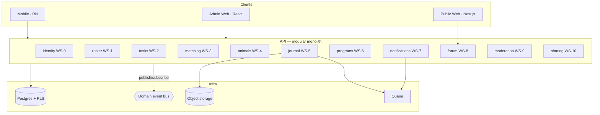
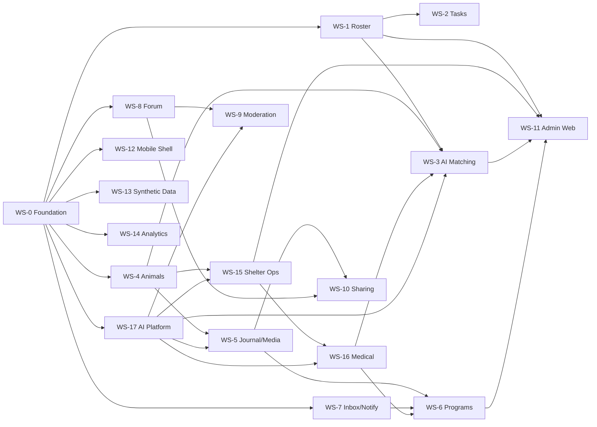

# WolfPack — Solution Architecture & Feature Breakdown

**Purpose:** decompose WolfPack into **independently buildable workstreams** so multiple developers (or teams) can work in parallel and merge without stepping on each other.

**Companion docs:**
- [`WolfPack-PRD.md`](WolfPack-PRD.md) — product requirements (feature IDs referenced here as F1.1, F5.3, etc.)
- [`WolfPack-Team-Split-By-Persona.md`](WolfPack-Team-Split-By-Persona.md) — **the same work organized by user persona** (foster, volunteer, admin, community). Use that doc for staffing and end-to-end ownership; use this one for module boundaries and merge safety.

**Status:** Draft v0.1

---

## 1. Solution overview

### 1.1 What we're building

**WolfPack replaces PetPoint** and becomes the shelter's system of record — then layers a volunteer/foster database, AI matching, and a behavioral journal on top. Three clients over one modular backend:

| Client | Users | Purpose |
|---|---|---|
| **Mobile app** (iOS + Android) | Fosters, Volunteers | Journaling, check-ins, task claim/release, inbox, forum |
| **Admin web** | Shelter admins, coordinators, staff | **Intake, kennel/location, medical, outcomes, regulatory reporting** + rosters, placements, AI matching, program editor, moderation |
| **Public web** | Anyone | Publicly readable community forum, adoption profiles |

> **Two implications of replacing PetPoint.** First, the shelter-operations modules (WS-15, WS-16) are **substrate** — most other streams depend on animals existing as real records. Second, we inherit system-of-record obligations: audit trails, soft-delete, statutory retention, point-in-time reconstruction, and rehearsed restores. These are engineering requirements, not paperwork.

### 1.2 Architectural stance: **modular monolith, not microservices**

One deployable backend, split into modules with **hard, lint-enforced boundaries**. This is the key decision that makes parallel development work:

- Teams get isolation (own module, own tables, own API surface) **without** distributed-systems overhead — no service mesh, no cross-service transactions, no 12 deploy pipelines.
- Any module can later be extracted into a service because the boundaries are already enforced.
- Merging is a code-review problem, not an integration-environment problem.

> **Rule:** a module may only touch another module through its **published interface** (`packages/contracts`) or via **domain events**. Direct cross-module database access is a build failure, not a code-review comment.

### 1.3 Proposed stack *(needs sign-off — see §9, D-1)*

| Layer | Choice | Why |
|---|---|---|
| Language | **TypeScript everywhere** | One `contracts` package shared by backend, mobile, and web. This is the single biggest parallelization multiplier — a contract change breaks compilation in every consumer immediately, at PR time. |
| Backend | **NestJS** (modular monolith) | First-class module system that maps 1:1 to workstreams; DI makes boundaries enforceable. |
| Database | **PostgreSQL** + Row-Level Security | RLS enforces tenant isolation at the data layer (F1.5), not in application code where it can be forgotten. |
| Mobile | **React Native (Expo)** | One codebase for iOS + Android; mature offline/media libraries; shares types and design system with web. |
| Admin & public web | **React + TypeScript** (Next.js for public web — SEO matters for the forum, F7.1) | |
| Media | S3-compatible object storage + async transcode workers | |
| Queue | Redis / BullMQ | Media processing, notification fan-out, scheduled check-ins |
| Search | Postgres FTS → OpenSearch if needed | Don't over-build search at M1 |
| Offline sync | WatermelonDB or SQLite + custom sync log | Required by F3.4 |

### 1.4 Repository layout

Single monorepo. Directory ownership is the parallelization boundary.

```
wolfpack/
├── packages/
│   ├── contracts/           # WS-0 · shared types, OpenAPI, event schemas, validators
│   ├── design-system/       # WS-0 · UI primitives shared by RN + web
│   └── sdk/                 # WS-0 · generated, typed API client
├── services/api/src/modules/
│   ├── identity/            # WS-0
│   ├── roster/              # WS-1
│   ├── tasks/               # WS-2
│   ├── matching/            # WS-3
│   ├── animals/             # WS-4
│   ├── journal/             # WS-5
│   ├── media/               # WS-5
│   ├── programs/            # WS-6
│   ├── notifications/       # WS-7
│   ├── forum/               # WS-8
│   ├── moderation/          # WS-9
│   ├── sharing/             # WS-10
│   ├── shelter-ops/         # WS-15
│   ├── medical/             # WS-16
│   ├── ai-platform/         # WS-17
│   └── analytics/           # WS-14
├── apps/
│   ├── mobile/src/features/ # WS-12 owns the shell; each feature dir owned by its WS team
│   ├── admin-web/           # WS-11
│   └── public-web/          # WS-8
└── tools/seed/              # WS-13
```

### 1.5 System diagram



---

## 2. How parallel development works here

Five mechanisms. All five are required — dropping any one reintroduces merge pain.

**1. Contract-first.** Before any workstream writes implementation code, it lands a PR to `packages/contracts` defining its types, endpoints, and events. Consumers code against that contract immediately, using generated mocks. **Nobody waits for anybody's implementation.**

**2. Exclusive ownership.** Every database table, module directory, and mobile feature directory has exactly one owning workstream (see §4 and §5.1). Two teams never edit the same file in the same sprint. Enforced via `CODEOWNERS`.

**3. Boundary enforcement in CI.** `dependency-cruiser` (or NestJS module rules) fails the build on any cross-module import that isn't through `contracts`. This turns architectural discipline into a test, not a hope.

**4. Feature flags by default.** Every workstream ships behind a flag from its first commit. Incomplete work merges to `main` continuously and stays dark. **No long-lived feature branches** — that's where merge conflicts are born.

**5. Domain events for cross-module effects.** When a task completes, `tasks` publishes `TaskCompleted`; `journal` subscribes and writes an entry. Neither module imports the other. This is what lets WS-2 and WS-5 ship independently.

### 2.1 Merge strategy

- **Trunk-based.** Branches live < 2 days. Merge to `main` behind flags.
- **Contract PRs are special:** changes to `packages/contracts` require review from every consuming workstream. This is the only place teams are forced to coordinate — keep it small and deliberate.
- **CI on every PR:** typecheck across all packages, module-boundary check, contract tests, unit tests, migration dry-run.
- **Daily integration build** deploys `main` to a shared environment seeded by WS-13.

---

## 3. Workstream dependency map



### 3.1 Parallelization waves

| Wave | Workstreams that can run **simultaneously** | Notes |
|---|---|---|
| **Wave 0** | WS-0 | Blocks everything. Keep it small and fast — resist scope creep. |
| **Wave 1** | WS-1, WS-4, WS-7, WS-8, WS-12, WS-13, WS-14, **WS-17** | **8 streams in parallel** — the widest point. WS-17 (AI platform) belongs here because six later streams depend on it. |
| **Wave 2** | WS-2, WS-5, **WS-15**, **WS-16**, WS-9, WS-11 (against mocks) | WS-15 is substrate — treat any slip here as a schedule risk to everything downstream. |
| **Wave 3** | WS-3, WS-6, WS-10, WS-11 (integration) | Consume the most contracts. |

**Minimum viable team:** 1 dev can serialize this, slowly. **Sweet spot:** 8–10 devs, roughly one per Wave-1 stream, re-forming into Waves 2 and 3. **Ceiling:** ~12 before coordination cost exceeds benefit.

**Two streams to staff first and well:** WS-0 (blocks all) and WS-17 (blocks six). Under-resourcing either one stalls the whole project regardless of how many people are on the others.

---

## 4. Feature-by-feature workstream specs

Format for each: **mission · depends on · owns · exposes · consumes · scope · out of scope · done when**

> Each workstream maps to an owning **persona team** — see the [reconciliation table](WolfPack-Team-Split-By-Persona.md#12-persona--workstream-reconciliation). Three workstreams (WS-1, WS-11, WS-12) are deliberately shared across teams via documented seams.

---

### WS-0 · Platform Foundation
**Mission:** everything every other stream needs, and nothing else.
**Depends on:** nothing · **Blocks:** all
**Team:** 1–2 senior devs · **Wave 0**

**Owns:** `packages/contracts`, `packages/design-system`, `packages/sdk`, `modules/identity`
**Tables:** `tenants`, `users`, `role_assignments`, `sessions`, `invitations`, `audit_log`, `feature_flags`
**Exposes:** auth endpoints, `RequireRole` guard, `TenantContext`, `AuditLogger`, `FeatureFlag` service, base entity conventions
**Consumes:** —

**Scope**
- Multi-tenant model with **Postgres RLS** enforcing isolation (F1.5) + automated isolation test suite
- Users with multi-role, multi-tenant assignments (F1.1, F1.2)
- Passwordless auth: email magic link, optional SMS OTP, optional passkey (F1.4)
- Admin invitation flow (F1.3)
- Foster experience tier as a tenant-scoped attribute, admin-overridable (F1.6)
- `packages/contracts` skeleton + codegen pipeline (OpenAPI → SDK)
- Design system: typography, color, spacing, buttons, forms, **large-tap-target and WCAG 2.2 AA primitives** (§7)
- i18n scaffolding (en / es / zh-Hant)
- Audit log service (F10.8)
- Feature flag service
- CI: typecheck, module-boundary check, migration runner, test harness

**Out of scope:** any product feature, any UI screen beyond the design system.

**Done when:** two tenants exist, a cross-tenant read is provably impossible, a user can log in on mobile and web, and another team can generate a typed client from a contract.

---

### WS-1 · Volunteer & Foster Database ⭐ *core bet*
**Mission:** the searchable roster of people that doesn't exist today.
**Depends on:** WS-0 · **Blocks:** WS-2, WS-3, WS-11
**Team:** 1–2 devs · **Wave 1**

**Owns:** `modules/roster`, `apps/mobile/src/features/profile`
**Tables:** `foster_profiles`, `volunteer_profiles`, `skills`, `certifications`, `availability_windows`, `capacity_constraints`, `reliability_stats`
**Exposes:** `GET/PUT /roster/*`, `POST /roster/availability`, `RosterQuery` service (used by matching), events `AvailabilityChanged`, `ProfileUpdated`
**Consumes:** identity (WS-0)

**Scope**
- Foster profile: home setup (yard, stairs, apartment), existing pets, kid ages, hours-away tolerance, medication-administration comfort, vehicle, max placement length, species/size limits, stated preferences (F6.3)
- Volunteer profile: skills, admin-verified certifications, travel radius, vehicle (F5.2)
- **Availability publishing**: recurring weekly + one-off exceptions (F5.1) — set once, adjust rarely
- Reliability stats: claim / completion / late-release history, non-punitive presentation (F5.6)
- Capacity & current-load tracking (feeds F6.7 load balancing)
- Rich roster query API: filter by skill, availability window, radius, capacity, tier
- Mobile profile & availability screens

**Out of scope:** matching logic (WS-3), task claim (WS-2), admin roster UI (WS-11 consumes this API).

**Done when:** an admin can answer "who is available Thursday 2–5pm, within 10 miles, with a vehicle and med-admin experience?" in one query.

---

### WS-2 · Task Marketplace
**Mission:** volunteers self-serve; coordinators stop brokering.
**Depends on:** WS-1 · **Blocks:** WS-3, WS-11
**Team:** 1–2 devs · **Wave 2**

**Owns:** `modules/tasks`, `apps/mobile/src/features/tasks`
**Tables:** `tasks`, `task_claims`, `task_categories`, `task_templates`, `task_completions`
**Exposes:** `GET/POST /tasks`, `POST /tasks/:id/claim`, `POST /tasks/:id/release`, events `TaskPublished`, `TaskClaimed`, `TaskReleased`, `TaskCompleted`
**Consumes:** roster (WS-1), animals (WS-4, optional link), notifications (WS-7)

**Scope**
- Task categories (F5.3): unscheduled vet visits, supply deliveries, transport, respite, photography, home checks, event support, ad-hoc
- Lifecycle `draft → published → claimed → in_progress → completed → verified` (F5.7)
- **Vote in / vote out**: one-tap claim and release (F5.5)
- Release → reason capture → **automatic backfill** republish + notify matching volunteers
- Urgency threshold: late release escalates directly to coordinator
- Personalized feed — **default view is tasks matching the volunteer's availability and radius**, not the firehose (F5.4)
- Completion proof (photo / note / signature) per task type
- Publishes `TaskCompleted` so WS-5 can auto-write a journal entry (F5.7) — no direct coupling
- Calendar view + **iCal/Google subscription feed** (F5.8)
- Recurring task generation from templates (F10.4)

**Out of scope:** ranking which volunteer *should* get a task (WS-3); the journal entry itself (WS-5).

**Done when:** a volunteer sees only relevant tasks, claims one in a tap, releases it, and a backfill notification reaches another matching volunteer — with zero coordinator involvement.

---

### WS-3 · AI Matching Engine ⭐ *core bet*
**Mission:** smart, explainable dog↔foster and dog↔volunteer compatibility — never automated assignment.
**Depends on:** WS-1, WS-4 (WS-2 optional) · **Blocks:** WS-11
**Team:** 2 devs (1 backend, 1 ML/AI) · **Wave 3**

**Owns:** `modules/matching`
**Tables:** `match_suggestions`, `match_decisions`, `match_overrides`, `scoring_config`, `model_versions`, `match_audit`
**Exposes:** `GET /matching/foster-candidates?animalId=`, `GET /matching/volunteer-candidates?animalId=`, `POST /matching/decisions`
**Consumes:** roster (WS-1), animals (WS-4), journal (WS-5, for LLM context), tasks (WS-2, optional)

**Scope**
- **Three-layer architecture** (F6.2) — the central design decision:
  1. **Hard constraint filter — deterministic code, never a model.** Safety and legality.
  2. **Compatibility scoring** — structured ML / weighted heuristics over lifestyle↔needs dimensions.
  3. **LLM reasoning layer** — reads the dog's journal history and the candidate's profile, produces nuanced fit assessment + plain-language rationale.
- **Dog↔Foster matcher** (F6.4). Target behavior: *single person, studio apartment, in office 2 days/week* → surfaces small, independent, lower-energy or senior dogs; suppresses high-energy young dogs, separation-anxiety cases, and yard-required dogs. Lifestyle inputs: housing type/size/stairs/yard/building rules, WFH vs. office days, hours away, travel, household composition, activity level, experience, dealbreakers. Dog inputs: size, age, energy, **independence vs. velcro**, **alone-tolerance**, vocalization, medical complexity, behavioral flags, handling difficulty.
- **Dog↔Volunteer matcher** (F6.5) — a *compatibility* problem distinct from task scheduling: handling capability vs. the dog's handling difficulty (safety, not preference), temperament fit, **continuity with a familiar handler**, certifications, availability, physical capability.
- **Explainability as a hard API contract** (F6.3): every candidate returns `positiveFactors[]`, `negativeFactors[]`, `blockers[]`, confidence band, each **citing its evidence**. No bare scores. If it can't explain, it doesn't suggest.
- **Guardrails** (F6.7): protected characteristics excluded as inputs; distribution/bias audit job; load-balancing dampeners; **deterministic fallback if the LLM is unavailable** (degrade to layers 1–2 and say so); full audit trail of model version + prompt version + inputs; **no foster PII sent to any model**.
- **Learning loop** (F6.8): override reasons + placement outcomes, outcome-weighted over acceptance-weighted; model changes flagged and evaluated against held-out historical placements.
- Bulk triage endpoint for intake surges (F6.9)
- Foster/volunteer-facing "why you were matched" payload (F6.10)
- Weights configurable **without a deploy** — coordinators will tune

**Out of scope:** auto-assignment (forbidden by D4); admin UI (WS-11); task scheduling (WS-2).

**Done when:** the studio-apartment example above produces the right ranking with a rationale a coordinator can read aloud to a foster, and an automated test proves no protected characteristic reaches the model.

---

### WS-4 · Animal Profile & Timeline
**Mission:** the composite dog record, including what PetPoint doesn't hold.
**Depends on:** WS-0 · **Blocks:** WS-3, WS-5, WS-10
**Team:** 1–2 devs · **Wave 1**

**Owns:** `modules/animals`, `apps/mobile/src/features/animal`
**Tables:** `animals`, `placements`, `behavioral_flags`, `adoption_history`
**Exposes:** `GET /animals/:id`, `GET /animals/:id/timeline`, `POST /placements`, events `PlacementStarted`, `PlacementEnded`
**Consumes:** identity, shelter-ops (WS-15), medical (WS-16), AI platform (WS-17)

**Scope**
- **Species-agnostic** animal model (D8), with `external_ref` + `source_system` on every entity for the one-time PetPoint migration (F11.9)
- **Residency clock** (§6): days in system, at facility, in foster (current + cumulative), placement count, full custody chain — first-class computed fields, always visible
- Placement lifecycle: foster / foster-to-adopt / respite / medical-hold / hospice; create, extend, transfer, close, record outcome (F10.3)
- **Dynamic behavioral profile with evidence links** (F4.2, AI-1): flags are **inferred from journal entries and proposed as suggestions** via WS-17, each linked to its supporting entries. The profile writes itself as the dog is cared for — no unsourced assertions, no manual data entry burden.
- Composite profile assembly (F4.1) and filterable timeline view (F4.3)
- **AI-drafted adoption profile** (F4.5, AI-11): adopter-facing narrative generated from `shareable`/`public` journal entries, admin-reviewed before publish
- **Role-based redaction** (F4.6): foster home addresses never visible to non-admins

**Out of scope:** intake/outcome/location (WS-15); medical records (WS-16); journal entry creation and media (WS-5).

**Done when:** a dog's profile shows an accurate residency clock, an evidence-linked behavioral profile, and a filterable multi-author timeline.

---

### WS-5 · Journaling & Media Pipeline ⭐ *highest technical risk*
**Mission:** make capture so frictionless that fosters actually do it.
**Depends on:** WS-4 · **Blocks:** WS-6, WS-10
**Team:** 2 devs (1 mobile-heavy, 1 backend/media) · **Wave 2**

**Owns:** `modules/journal`, `modules/media`, `apps/mobile/src/features/journal`
**Tables:** `journal_entries`, `journal_corrections`, `media_assets`, `transcriptions`, `sync_log`
**Exposes:** `POST /journal`, `GET /animals/:id/journal`, media upload endpoints, event `JournalEntryCreated`
**Consumes:** animals (WS-4), subscribes to `TaskCompleted` (WS-2) and `CheckInCompleted` (WS-6)

**Scope**
- 13 entry types (F3.1): note, photo, video, audio, weight, meal, elimination, medication_given, behavior_observation, milestone, concern, vet_visit_summary
- **Zero-friction capture** (F3.2): persistent capture button; post with *no required fields*; enrich afterward
- **Offline-first, resumable** (F3.4): local write → queue → chunked resumable upload; per-entry sync state; **survives app kill and phone restart**. This is the hardest engineering problem in the project — budget accordingly.
- **Voice-first** (F3.3): audio auto-transcribed, transcript searchable; dictation anywhere text is accepted
- Media pipeline: client-side compression, transcode, adaptive playback, thumbnails, **unconditional EXIF/geolocation stripping** (F3.8)
- **Append-only** (F3.6): short edit window, then corrections append as linked entries
- Structured extraction (F3.7): suggest weights/tags from unstructured entries — **always confirmable, never silently authoritative**
- Visibility model: `shelter-only` / `shareable` / `public` (F3.8)
- Multi-author timeline writes with role attribution (F3.5)
- Auto-generate entries from `TaskCompleted` events

**Out of scope:** the prompt *schedule* (WS-6 decides when to ask); the timeline *view* (WS-4).

**Done when:** a foster records a 3-minute video in airplane mode, force-quits the app, reconnects hours later, and the entry uploads intact with a searchable transcript.

---

### WS-6 · Care Programs & Check-ins
**Mission:** tiered onboarding — high-touch for beginners, near-silent for experts.
**Depends on:** WS-5, WS-7 · **Blocks:** WS-11
**Team:** 1–2 devs · **Wave 3**

**Owns:** `modules/programs`, `apps/mobile/src/features/checkins`
**Tables:** `care_programs`, `program_versions`, `program_steps`, `checkins`, `checkin_responses`, `escalations`, `mentor_pairings`
**Exposes:** `GET /programs/my-schedule`, `POST /checkins/:id/respond`, events `CheckInDue`, `CheckInMissed`, `ConcernRaised`
**Consumes:** journal (WS-5), notifications (WS-7), animals (WS-4)

**Scope**
- **Care Program templates** keyed by (foster tier × placement type), tenant-scoped and **versioned** (F2.1)
- Beginner 14-day program (F2.2): pre-arrival checklist + home prep, daily days 1–7, every-other-day days 8–14, milestone celebrations, graduation to intermediate cadence
- Intermediate: weekly + milestone-triggered (F2.3)
- **Experienced: exception-only** — one weekly entry, condition-specific prompts only for medical/behavioral cases (F2.4)
- Check-in UX: tap-first questions, **completable in under 30 seconds** (F2.5); every check-in produces a journal entry
- **Mentor pairing** for beginners with in-app DM (F2.2)
- Missed check-in escalation (F2.6): in-app → badge → **coordinator alerted in dashboard and reaches out personally**. The app does not nag.
- **Concern escalation** (F2.7): "Something's wrong" → high-priority admin item + urgent push to on-call coordinator + foster triage path. **Emergency vet contact reachable in ≤ 2 taps from anywhere.**
- Scheduling engine (queue-driven) that materializes due check-ins
- No-code program editor API for WS-11 (F10.5)

**Out of scope:** the notification delivery mechanism (WS-7); the editor UI (WS-11).

**Done when:** a beginner and an expert on the same day receive appropriately different prompt volumes, and a missed check-in surfaces to a coordinator rather than escalating pressure on the foster.

---

### WS-7 · Inbox & Notifications
**Mission:** quiet by default — the app pulls, it doesn't push.
**Depends on:** WS-0 · **Blocks:** WS-6
**Team:** 1 dev · **Wave 1**

**Owns:** `modules/notifications`, `apps/mobile/src/features/inbox`
**Tables:** `notifications`, `notification_preferences`, `push_tokens`, `digest_queue`, `urgent_allowlist`
**Exposes:** `GET /inbox`, `POST /inbox/:id/read`, `NotificationService.send()` (used by all modules)
**Consumes:** identity; subscribes to events from every module

**Scope**
- **In-app Inbox is the primary and durable channel** (F9.1) — badge count, read state; **if push fails or is off, nothing is lost**
- Three classes (F9.2): Urgent (in-app + one push, from a **short allow-list requiring product sign-off**), Actionable (in-app only), Informational (in-app only, never interrupts)
- **No SMS notifications** (F9.3). SMS exists only for WS-0 auth/invites.
- Email = **opt-in digest only**, daily or weekly (F9.4)
- Tier-aware in-app cadence — modulates inbox volume, not buzz frequency (F9.5)
- **Hard daily cap** on interruptive notifications + quiet hours honored by every class (F9.6)
- **Push fully optional** (F9.7): product must be 100% usable with push disabled — this is a design requirement, not a degraded mode
- Coordinator-mediated escalation routing (F9.8)
- Read accounting for escalation logic (F9.9)
- Track **push opt-out rate** as a health metric (R5)

**Out of scope:** deciding *what* is worth notifying (each feature stream declares its events); escalation policy (WS-6).

**Done when:** a user with push disabled misses nothing, and adding a new Urgent event type requires an explicit allow-list PR.

---

### WS-8 · Community Forum
**Mission:** publicly readable, cross-tenant knowledge sharing.
**Depends on:** WS-0 · **Blocks:** WS-9, WS-10
**Team:** 1–2 devs · **Wave 1**

**Owns:** `modules/forum`, `apps/public-web`, `apps/mobile/src/features/forum`
**Tables:** `forum_posts`, `forum_replies`, `forum_categories`, `forum_tags`, `post_votes`, `accepted_answers`
**Exposes:** `GET/POST /forum/*`, event `PostCreated`
**Consumes:** identity

**Scope**
- **Global, cross-tenant scope** (D5) — deliberately outside tenant isolation. Must live in a schema with **no join path to operational data** (R10), verified by automated test.
- Public read without an account; **posting requires authentication** (F7.1)
- `community_member` self-registration with email verification, rate limits, and **first-post review queue** (F7.2)
- Categories, tags, full-text search, **"similar questions" surfaced before posting** to cut duplicates (F7.3)
- Question workflow: mark as question, helpful replies, OP accepts an answer; urgent questions visually distinct and can notify opted-in experts (F7.4)
- **Role badges** — Experienced Foster, Shelter Staff, Veterinarian, Volunteer; verified badges admin-granted (F7.5). Trust signals matter when the topic is medical.
- Journal → forum promotion in one tap, carrying media, with explicit visibility-change confirmation (F7.8)
- SEO-optimized public rendering (Next.js SSR)

**Out of scope:** moderation and safety (WS-9 — separate stream because it's safety-critical); Instagram sharing (WS-10).

**Done when:** an anonymous visitor can read and search the forum, a foster from any tenant can post, and an automated test proves the forum cannot reach operational data.

---

### WS-9 · Moderation & Safety ⚠️ *highest liability*
**Mission:** make a fully public forum safe to operate.
**Depends on:** WS-8 · **Blocks:** public launch
**Team:** 1–2 devs + policy/legal partner · **Wave 2**
> **Start policy and legal work at M1, not M5.** The engineering is tractable; the policy lead time is not.

**Owns:** `modules/moderation`, admin moderation console (co-located with WS-11)
**Tables:** `moderation_queue`, `flags`, `pii_detections`, `bans`, `moderation_actions`, `emergency_interceptions`
**Exposes:** `POST /moderation/screen` (pre-publish hook), `GET /moderation/queue`
**Consumes:** forum (WS-8)

**Scope**
- **Pre-publication screening pipeline** — every post/reply passes through before going live
- **Automatic PII scrubbing** (F7.7): detect and block street addresses, phone numbers, foster home identifiers. **Non-optional — this is foster personal safety** (R3).
- **Emergency interception** (F7.6): keyword detection for bloat, seizure, toxin ingestion, breathing difficulty, uncontrolled bleeding, collapse, parvo signs → interstitial urging immediate veterinary contact **before publication**, with local emergency vet info. If the poster is an active foster, **also alert their shelter coordinator.**
- Non-dismissible medical disclaimers on medical-category posts (F7.6)
- Spam / abuse / animal-cruelty content screening
- Peer flagging + prioritized moderator queue
- Moderator tooling: remove, lock, ban; platform-level and per-tenant delegation
- Published moderation policy + appeals path

**Out of scope:** forum CRUD (WS-8).

**Done when:** a post containing a home address is blocked, a post describing bloat triggers interception and alerts a coordinator, and moderators can clear a queue.

---

### WS-10 · Social Sharing
**Mission:** turn journal moments into adoption reach.
**Depends on:** WS-5, WS-8 · **Team:** 1 dev · **Wave 3**

**Owns:** `modules/sharing`, `apps/mobile/src/features/share`
**Tables:** `share_events`, `share_consents`, `rendered_assets`
**Exposes:** `POST /sharing/render`, `POST /sharing/publish`

**Scope**
- **Path A — personal accounts (primary):** render a branded, correctly-sized asset (1:1, 4:5, 9:16 Story), copy a pre-written caption + hashtags to clipboard, hand off to the **native OS share sheet**. Instagram's Graph API cannot post to personal accounts, so this is the realistic path (F8.2).
- **Path B — shelter accounts:** connect an Instagram Business account via Graph API for staff-approved direct publishing from admin web
- **Consent & safety gate** (F8.3): blocked unless foster granted media-sharing consent for that placement, entry is `public`, EXIF stripped, and no foster home identifiers visible. Admins may require approval on anything referencing their dogs.
- Attribution: shelter branding, dog name, adoption status/link (F8.4)
- **Channel-agnostic pipeline** so Facebook/TikTok/X drop in later (F8.5)

**Out of scope:** journal entries (WS-5), forum posts (WS-8).

**Done when:** a foster shares a milestone to a personal Instagram in 3 taps, and the asset provably contains no location data or home identifiers.

---

### WS-11 · Admin Web Dashboard
**Mission:** exception-first operations console.
**Depends on:** WS-1, WS-2, WS-3, WS-6 · **Team:** 1–2 devs · **Wave 2 → 3**
> Can start in Wave 2 against contracts + mocks, well before WS-3 and WS-6 are implemented. **This is the clearest demonstration of why contract-first matters.**

**Owns:** `apps/admin-web`
**Tables:** none (pure consumer) · **Consumes:** all modules

**Scope**
- **Operations home — exception-first, not a firehose** (F10.1): dogs without fosters, overdue check-ins, raised concerns, unclaimed urgent tasks, placements ending soon, dogs over LOS thresholds
- Roster management with search, filters, saved views, bulk actions (F10.2)
- Placement management: create, extend, transfer, close, record outcome (F10.3)
- **Matching review UI** — ranked candidates with plain-language reasoning, override + reason capture (F6.2, F6.5); bulk triage board (F6.6)
- Task authoring + recurring templates (F10.4)
- **No-code Care Program editor** (F10.5) — shelter staff must maintain programs without engineering (R12)
- Moderation console shell (WS-9 supplies logic)
- Reporting + CSV export, shaped for board reporting and Shelter Animals Count (F10.7)
- Audit log viewer (F10.8)

**Done when:** a coordinator can run a full day — triage exceptions, place a dog, publish tasks, edit a program — without touching a spreadsheet.

---

### WS-12 · Mobile App Shell
**Mission:** the chassis every mobile feature plugs into.
**Depends on:** WS-0 · **Blocks:** mobile work in WS-1/2/5/6/7/8/10
**Team:** 1 dev · **Wave 1** *(front-load this — it unblocks six streams)*

**Owns:** `apps/mobile` shell — navigation, offline layer, auth flows, i18n runtime, a11y harness, build & release pipeline

**Scope**
- Navigation architecture with a **feature-module registry** so each WS team owns its own directory and registers routes without editing shared files — this is what prevents mobile merge conflicts
- **Offline persistence layer + sync engine** exposed as a reusable primitive (WS-5 is the heaviest consumer, but tasks and check-ins need it too)
- Auth screens (magic link, OTP, passkey)
- **Persistent capture button** available from anywhere (§7 principle 2)
- i18n runtime, accessibility harness, **VoiceOver/TalkBack verification in CI**
- App Store / Play Store pipelines, crash reporting, OTA updates

**Out of scope:** any feature screen — those belong to their owning workstream.

**Done when:** a feature team can add a screen by creating one directory and registering it, with zero edits to shared files.

---

### WS-13 · Synthetic Data & Environments
**Mission:** realistic data on day one, since PetPoint is out of scope (D2).
**Depends on:** WS-0 (schema only) · **Team:** 1 dev · **Wave 1**
> Starts early and **grows with each schema**. Every workstream contributes its own generator module.

**Owns:** `tools/seed`

**Scope**
- Deterministic, seeded generator (reproducible environments) per PRD §10
- Volumes: 3 tenants, 250 dogs, 120 fosters, 200 volunteers, 400 placements, 15k journal entries, 4k media, 2k medical events, 1.5k tasks, 400 forum posts
- **Volunteer/foster/task data is the richest slice** — matching quality can't be evaluated against a thin or uniform roster (§10.2)
- **Realism requirements:** long-tailed LOS (the tail is where the product proves value); behavioral flags **must** have supporting journal entries or F4.2 evidence-linking is untestable; temporal consistency in weight series, medication courses, non-overlapping placements
- Edge cases: neonate litters, hospice, bite history, quarantine, multi-foster dogs, returned adoptions, churned fosters, flaky volunteers
- Forum content including posts that **should** trip emergency interception and PII scrubbing (WS-9 test fixtures)
- **No real PII; no scraped media.** Fully synthetic or licensed.
- One-command demo environment reset

**Done when:** any developer resets to a known, realistic state in one command, and matching returns non-trivial results.

---

### WS-14 · Analytics & Instrumentation
**Mission:** the §4 metrics are unmeasurable retroactively — instrument from day one.
**Depends on:** WS-0 · **Team:** 1 dev (part-time) · **Wave 1**

**Owns:** `modules/analytics`, event schema in `packages/contracts`

**Scope**
- Event schema + typed emit API used by every workstream
- Primary metric instrumentation: task fill rate, time-to-fill, coordinator hours, time-to-place, match acceptance rate, roster currency
- Secondary: journaling adoption, profile completeness, check-in compliance, retention, failed placements, LOS, forum time-to-first-answer, **push opt-out rate**
- Per-tenant dashboards; alerting on urgent-notification delivery failure

**Done when:** every §4 metric has a live query, and adding an unrecognized event fails typecheck.

---

### WS-15 · Shelter Operations — system of record ⭐ *substrate*
**Mission:** replace PetPoint. Intake through outcome, in WolfPack.
**Depends on:** WS-0, WS-4 (animal entity), WS-17 (for smart intake) · **Blocks:** WS-11, WS-16, and effectively everything downstream
**Team:** 2 devs · **Wave 1–2** *(start as early as the animal entity exists)*

**Owns:** `modules/shelter-ops`
**Tables:** `intakes`, `outcomes`, `locations`, `location_assignments`, `holds`, `transfers`, `partner_orgs`, `microchips`, `report_runs`
**Exposes:** intake/outcome/location/transfer APIs, `CapacityService`, events `AnimalIntake`, `AnimalOutcome`, `LocationChanged`
**Consumes:** animals (WS-4), AI platform (WS-17), identity

**Scope**
- **Intake** (F11.1): all intake types, full capture, litter/bulk intake with linked siblings, jurisdiction-configurable **stray hold clock** with visible countdown
- **Smart intake** (AI-5, via WS-17): photo → breed/age/sex/weight suggestions; **OCR** of surrender forms and incoming vet records; microchip-based duplicate and return detection
- **Kennel & location** (F11.2): building → room/ward → kennel hierarchy; states (available, occupied, cleaning, out-of-service, quarantine); full movement history. **Foster home is a location type** — this is what makes the custody chain continuous on-site and off-site.
- **Capacity forecasting** (AI-10) and smart kennel assignment
- **Outcomes** (F11.5): adoption, RTO, transfer-out, euthanasia (deliberately audit-heavy with required approvals), died-in-care, missing
- **Transfers** (F11.6) with a partner-organization registry and batch support
- **Microchip** (F11.4): registry, registration status, transfer-to-adopter workflow
- **Regulatory reporting** (F11.7): auto-generated **Shelter Animals Count** matrix, live release rate, LOS, capacity utilization; per-tenant state/local templates
- **Records integrity** (F11.8): soft delete only, point-in-time reconstruction, per-tenant retention, audit log on every mutation
- **PetPoint migration** (F11.9): CSV/export importer, reconciliation report, parallel-run support

**Out of scope:** medical records (WS-16); admin UI (WS-11 consumes these APIs).

**Done when:** a dog can be taken in, moved between kennels, fostered, treated, and adopted out entirely within WolfPack — and a generated SAC report matches a hand-computed control for the same period.

---

### WS-16 · Medical Records & Health Intelligence
**Mission:** shelter-delivered medical care, plus early warning before things become emergencies.
**Depends on:** WS-4, WS-15, WS-17 · **Blocks:** WS-6 (medication reminders), WS-3 (medical hard constraints)
**Team:** 1–2 devs · **Wave 2**

**Owns:** `modules/medical`
**Tables:** `medical_events`, `vaccinations`, `vaccination_schedules`, `medication_courses`, `medication_administrations`, `weight_series`, `medical_alerts`
**Exposes:** medical APIs, events `MedicationDue`, `VaccinationOverdue`, `HealthAnomalyDetected`
**Consumes:** animals (WS-4), journal (WS-5 — anomaly signal source), AI platform (WS-17)

**Scope**
- Structured medical events: exam, procedure/surgery, diagnostic, treatment, spay/neuter, euthanasia (F11.3)
- **Vaccination series tracking** (e.g., DHPP) with due dates and automatic overdue flagging
- **Medication courses** → generate foster reminders and adherence tracking (feeds WS-6, F2.4)
- Weight series with trend charting
- **Health-trend anomaly detection** (AI-6): weight-loss trajectory, declining appetite across journal entries, medication non-adherence, recurring symptom mentions → **staff alert before it becomes a crisis.** This is where journaling pays dividends back into the medical record.
- **Symptom triage assist** (AI-7) on concern flags — severity + urgency, **advisory only, never a diagnosis** (F12.5)
- Medical alerts feed matching hard constraints (F6.4)
- Spay/neuter status with required-before-adoption gating
- Light-touch **vet role**: read the timeline, append a visit summary — no workflow displacement (§5.6)

**Out of scope:** clinical EMR functionality; EasyVet integration (future, §14).

**Done when:** a medication course generates foster reminders with tracked adherence, and a declining weight trend raises a staff alert before any human notices it manually.

---

### WS-17 · AI Platform ⭐ *front-load this*
**Mission:** the shared substrate all 15 AI capabilities run on.
**Depends on:** WS-0 · **Blocks:** WS-3, WS-5, WS-9, WS-11, WS-15, WS-16
**Team:** 1–2 devs (ML/AI) · **Wave 1** *(it unblocks six streams — build it early, not alongside the first capability)*

**Owns:** `modules/ai-platform`, AI schemas in `packages/contracts`, suggestion UI in `packages/design-system`
**Tables:** `ai_suggestions`, `model_versions`, `prompt_versions`, `inference_log`, `eval_runs`, `capability_flags`
**Exposes:** `InferenceService`, `SuggestionService` (create / accept / reject / edit), `EvalHarness`, `CostTracker`

**Scope**
- **The suggestion contract as a shared primitive** (F12.1): suggestion + evidence links + confidence band + model/prompt version + accept/reject/edit. Every capability uses it. **This is what makes 15 AI features feel like one coherent system instead of 15 bespoke experiments.**
- Model gateway with provider abstraction; self-hosted and enterprise-tier support (F12.4)
- **PII redaction enforced at the gateway** — so no capability can accidentally leak foster PII to a model, even by mistake
- **Per-capability feature flags with kill switches** (F12.7)
- **Graceful-degradation framework** (F12.3): every capability must register a non-AI fallback to be enabled. The system of record never depends on a model being up.
- Cost tracking, per-tenant caps, and 3s interactive latency budget enforcement (F12.6)
- **Eval harness**: offline eval sets, acceptance-rate monitoring, regression gates on prompt/model changes
- Full inference audit log
- Shared suggestion-review UI components (accept/reject/edit with evidence display)

**Out of scope:** the individual capabilities — those live in their owning workstream and consume this platform.

**Pilot phasing (F12.8):** the pilot ships **AI-1…AI-5** (dynamic profile assembly, structured extraction, transcription, matching, smart intake) plus **AI-14 forum safety**, which is a launch gate rather than a feature — a fully public forum cannot go live without PII scrubbing and emergency interception. The remaining nine capabilities are built **fallback-first**: their non-AI paths (manual health review, saved-filter search, templated reports) ship with the owning workstream, so enabling each capability later is a flag flip, not a rewrite.

**Done when:** a new AI capability can be added with a prompt, an eval set, and a fallback — and inherits PII redaction, cost control, audit logging, latency budget, and a kill switch for free.

---

## 5. Shared contracts — the merge glue

### 5.1 Table ownership (write access is exclusive)

| Workstream | Tables owned |
|---|---|
| WS-0 | `tenants`, `users`, `role_assignments`, `sessions`, `invitations`, `audit_log`, `feature_flags` |
| WS-1 | `foster_profiles`, `volunteer_profiles`, `skills`, `certifications`, `availability_windows`, `capacity_constraints`, `reliability_stats` |
| WS-2 | `tasks`, `task_claims`, `task_categories`, `task_templates`, `task_completions` |
| WS-3 | `match_suggestions`, `match_decisions`, `match_overrides`, `scoring_config` |
| WS-4 | `animals`, `placements`, `behavioral_flags`, `adoption_history` |
| WS-5 | `journal_entries`, `journal_corrections`, `media_assets`, `transcriptions`, `sync_log` |
| WS-6 | `care_programs`, `program_versions`, `program_steps`, `checkins`, `checkin_responses`, `escalations`, `mentor_pairings` |
| WS-7 | `notifications`, `notification_preferences`, `push_tokens`, `digest_queue`, `urgent_allowlist` |
| WS-8 | `forum_posts`, `forum_replies`, `forum_categories`, `forum_tags`, `post_votes`, `accepted_answers` |
| WS-9 | `moderation_queue`, `flags`, `pii_detections`, `bans`, `moderation_actions`, `emergency_interceptions` |
| WS-10 | `share_events`, `share_consents`, `rendered_assets` |
| WS-15 | `intakes`, `outcomes`, `locations`, `location_assignments`, `holds`, `transfers`, `partner_orgs`, `microchips`, `report_runs` |
| WS-16 | `medical_events`, `vaccinations`, `vaccination_schedules`, `medication_courses`, `medication_administrations`, `weight_series`, `medical_alerts` |
| WS-17 | `ai_suggestions`, `model_versions`, `prompt_versions`, `inference_log`, `eval_runs`, `capability_flags` |

**Rule:** cross-workstream reads go through the owning module's service interface. Cross-workstream **writes** go through domain events. No exceptions.

### 5.2 Domain events (the async seams)

| Event | Publisher | Subscribers |
|---|---|---|
| `TaskCompleted` | WS-2 | WS-5 (auto journal entry), WS-1 (reliability), WS-14 |
| `TaskReleased` | WS-2 | WS-7 (backfill notify), WS-1 (reliability) |
| `JournalEntryCreated` | WS-5 | WS-4 (timeline, evidence links), WS-6, WS-14 |
| `ConcernRaised` | WS-6 | WS-7 (urgent push), WS-11 (admin queue) |
| `CheckInMissed` | WS-6 | WS-7, WS-11 |
| `PlacementStarted` / `PlacementEnded` | WS-4 | WS-6 (program), WS-1 (load), WS-14 |
| `AvailabilityChanged` | WS-1 | WS-3 (re-rank), WS-2 (feed) |
| `PostCreated` | WS-8 | WS-9 (screening), WS-14 |
| `MatchDecided` | WS-3 | WS-4 (placement), WS-14 |
| `AnimalIntake` | WS-15 | WS-4 (residency clock), WS-16 (initial exam), WS-14 |
| `AnimalOutcome` | WS-15 | WS-4 (close clock), WS-14 |
| `LocationChanged` | WS-15 | WS-4 (custody chain), WS-14 |
| `HealthAnomalyDetected` | WS-16 | WS-7 (staff alert), WS-11 (admin queue) |
| `MedicationDue` / `VaccinationOverdue` | WS-16 | WS-6 (foster reminder), WS-7, WS-11 |
| `SuggestionAccepted` / `SuggestionRejected` | WS-17 | WS-14 (acceptance-rate metric), owning capability |

### 5.3 Contract change protocol
1. PR to `packages/contracts` only — no implementation in the same PR.
2. `CODEOWNERS` auto-requests review from every consuming workstream.
3. Additive changes merge freely. **Breaking changes require a deprecation window** and a migration note.
4. CI regenerates the SDK and typechecks all consumers. Red build = the change isn't safe.

---

## 6. Testing strategy

| Level | Owner | What |
|---|---|---|
| **Unit** | Each WS | Own module logic, ≥ 80% on business rules |
| **Contract** | Each WS | Provider verifies its published contract; consumers test against generated mocks. **This is what lets streams merge without integration hell.** |
| **Tenant isolation** | WS-0 (suite), all (must pass) | Automated proof that cross-tenant reads fail and the forum has no path to operational data (R10) |
| **Integration** | Rotating | Daily build on `main` against WS-13 seed data |
| **E2E** | Rotating | Critical journeys: foster journals offline → syncs; volunteer claims → releases → backfill; admin matches → places; post trips PII scrub |
| **Accessibility** | WS-12 harness, all | WCAG 2.2 AA; VoiceOver + TalkBack verified in CI |
| **Load** | WS-5 | Media pipeline at 500MB video × concurrent uploads |

---

## 7. Milestone mapping

| Milestone | Workstreams | Exit criteria |
|---|---|---|
| **M1 Foundation** | WS-0, WS-12, WS-13, WS-14, **WS-17** | Two tenants provably isolated; login on mobile + web; seeded environment; contract codegen live; a sample AI capability runs end-to-end through the suggestion contract with a fallback |
| **M2 Shelter core** | **WS-15**, WS-4, **WS-16** | A dog can be taken in, moved, treated, and adopted out entirely in WolfPack; generated SAC report matches a hand-computed control |
| **M3 Core bet** | WS-1, WS-2, WS-7 | Roster queryable by skill/availability/radius; tasks claimed and released with automatic backfill; quiet inbox working with push disabled |
| **M4 Journaling** | WS-5 | Offline capture survives app kill and uploads intact; behavioral flags auto-proposed from journal entries with evidence links |
| **M5 Intelligence & ops** | WS-3, WS-6, WS-11 | Studio-apartment match example produces the right ranking with a readable rationale; tier-differentiated check-in cadence; coordinator runs a full day in the dashboard |
| **M6 Community** | WS-8, WS-9, WS-10 | Public forum live; **AI-14 PII scrub + emergency interception verified (hard launch gate)**; Instagram share works |
| **M7 Migration & pilot** | WS-15 + all | PetPoint import reconciles; parallel run passes; SFSPCA cohort instrumented against §4 baselines. **No PetPoint decommission until reconciliation passes.** |
| **M8 GA** | all | es/zh-Hant complete; a11y audit passed; moderation staffed; restore drill rehearsed |

---

## 8. Risks to *parallelization* specifically

| # | Risk | Mitigation |
|---|---|---|
| PR1 | **WS-0 becomes a bottleneck** and everyone idles | Keep WS-0 ruthlessly minimal; staff it with the two most senior devs; timebox it hard |
| PR2 | **Contract churn** forces constant rework | Contract-first with a review gate; additive-by-default; breaking changes need a deprecation window |
| PR3 | **Mobile merge conflicts** in shared navigation/state | WS-12 feature-module registry — teams add a directory, never edit shared files |
| PR4 | **WS-5 offline sync overruns** and blocks WS-6 and WS-10 | Highest-risk stream: spike the sync engine during M1, before committing to a schedule |
| PR5 | **Everyone needs realistic data before WS-13 is ready** | WS-13 starts in Wave 1 and each stream contributes its own generator module as schemas land |
| PR6 | **Module boundaries erode** under deadline pressure | Enforced in CI as a build failure — not a review convention |
| PR7 | **WS-9 policy lead time** blocks public launch even though code is done | Start legal/policy at M1; treat it as a parallel non-engineering workstream |
| PR8 | **WS-17 (AI platform) is under-staffed** and becomes a second bottleneck — six streams wait on it | Staff it in Wave 1 alongside WS-0; ship the suggestion contract and one reference capability before any consumer starts |
| PR9 | **WS-15 (shelter ops) slips**, and it's substrate — everything downstream slides with it | Start as soon as the animal entity exists; split intake / location / outcomes into independently shippable slices so partial progress still unblocks consumers |
| PR10 | **Each team builds its own bespoke AI UX**, producing 15 inconsistent experiences | The suggestion contract and shared review components are owned by WS-17 and are mandatory — capability teams supply prompts, evals, and fallbacks, not UI |
| PR11 | **PetPoint migration is treated as a final-week task** and derails the pilot | Build the importer during M2 against real export samples; reconcile continuously, not once at cutover |

---

## 9. Decisions still needed

| # | Decision | Blocks |
|---|---|---|
| D-1 | **Confirm the stack** (§1.3), especially React Native vs. native and NestJS vs. alternatives | WS-0 |
| D-2 | Modular monolith confirmed over microservices? | WS-0 |
| D-3 | Team size and how many parallel streams we can actually staff | Wave planning |
| D-4 | Hosting/cloud provider (drives media, queue, storage choices) | WS-0, WS-5 |
| D-5 | Buy vs. build for transcription (Whisper self-hosted vs. managed) | WS-5 |
| D-6 | Buy vs. build for moderation screening (managed content-safety API vs. in-house) | WS-9 |
| D-7 | Final product name — "WolfPack" vs. "The Foster Pack" | Repo, branding, store listings |
| D-8 | **Model provider**, and whether SFSPCA's privacy posture requires a self-hosted option | WS-17 |
| D-9 | ~~Which AI capabilities are pilot must-haves~~ **Resolved:** AI-1…AI-5 for pilot; AI-14 gates the public forum; the other nine ship fallback-first and enable post-pilot | — |
| D-10 | Per-tenant AI cost ceiling | WS-17 |
| D-11 | Jurisdictions whose stray-hold rules and reporting templates we must support at launch | WS-15 |
| D-12 | PetPoint cutover plan: who signs off, and what are the parallel-run exit criteria | WS-15, M7 |
