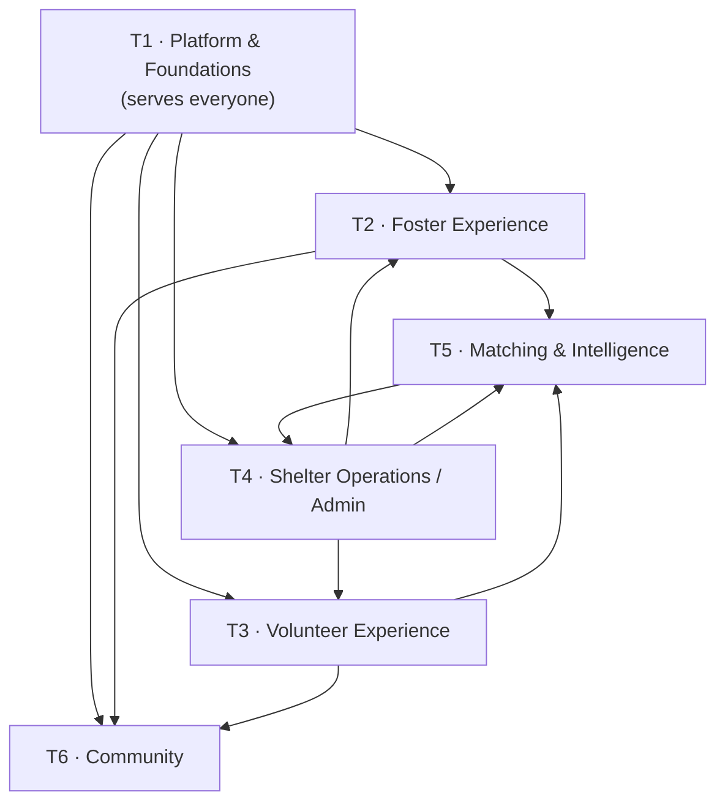

# WolfPack — Development Split by User Persona

**Companion to:** [`WolfPack-Solution-Breakdown.md`](WolfPack-Solution-Breakdown.md) (module view) and [`WolfPack-PRD.md`](WolfPack-PRD.md) (product view)
**Purpose:** organize development around **who we're building for**, so a developer can say *"I own the volunteer experience"* rather than *"I own the tasks module."*

---

## 1. Why two views of the same work

The breakdown doc splits work by **technical module** — good for enforcing boundaries and merge safety. This doc splits the same work by **user persona** — good for staffing, ownership, and making sure someone is accountable for each user's end-to-end experience.

They are not alternatives. Use both:

| Question | Use |
|---|---|
| "Who owns this table / can I import this module?" | Module view (breakdown §5.1) |
| "Who is accountable for the volunteer's experience being good?" | **This doc** |
| "What do I build this sprint?" | This doc → then the module spec in breakdown §4 |

> **The failure this prevents:** with a pure module split, nobody owns *"can a first-time foster actually get through their first week?"* — that journey crosses five modules. Persona teams fix that.

---

## 2. Team topology

Six teams. Four are persona-aligned; two are horizontal by necessity.



| Team | Primary user | Surface | Devs | Maps to workstreams |
|---|---|---|---|---|
| **T1 · Platform & Foundations** | *(none — serves all)* | Shared infra | 3–4 | WS-0, WS-7, WS-12, WS-13, WS-14, WS-17 |
| **T2 · Foster Experience** | Foster (3 tiers) | Mobile | 3 | WS-5, WS-6, foster half of WS-1 |
| **T3 · Volunteer Experience** | Volunteer | Mobile | 2 | WS-2, volunteer half of WS-1 |
| **T4 · Shelter Operations** | Admin, coordinator, vet | Admin web | 4 | WS-4, WS-11, WS-15, WS-16 |
| **T5 · Matching & Intelligence** | Admin (decides), foster/volunteer (receives) | Admin web + mobile | 2 | WS-3 |
| **T6 · Community** | Everyone + public | Mobile + public web | 3 | WS-8, WS-9, WS-10 |

**Total: 17–18 developers at full parallelization.** See §9 for how to run this with 1, 3, or 6 people instead.

---

## 3. Ownership seams (read this before claiming anything)

Persona teams create three places where two teams want the same thing. Each is resolved explicitly — ambiguity here is what causes merge pain.

### Seam 1 — Shared person primitives
Both fosters and volunteers have availability, skills, and certifications. Rather than duplicating or splitting them, **T1 owns a shared `people` module** with those primitives; T2 and T3 own their persona-specific profile extensions.

| Owner | Tables |
|---|---|
| T1 (`people`) | `availability_windows`, `skills`, `certifications` |
| T2 (`roster/foster`) | `foster_profiles`, `capacity_constraints`, `mentor_pairings` |
| T3 (`roster/volunteer`) | `volunteer_profiles`, `reliability_stats` |

### Seam 2 — The admin web hosts other teams' features
The admin dashboard surfaces task authoring (T3's domain) and the care-program editor (T2's domain). If T4 built all of it, T4 becomes a bottleneck for everyone.

**Resolution — mirror the mobile pattern:** T4 owns the **admin web shell**, navigation, and operations home. **Every other team contributes its own admin feature modules** into a registry. Teams add a directory and register a route; they never edit shared files.

| Admin screen | Built by |
|---|---|
| Operations home, roster, placements, intake, kennel, medical, outcomes, reporting | T4 |
| Task authoring + recurring templates | **T3** |
| Care Program editor | **T2** |
| Matching review + bulk triage board | **T5** |
| Moderation console | **T6** |

### Seam 3 — One mobile app, three personas
A single user can be a foster *and* a volunteer. T1 owns the mobile shell and the feature-module registry; T2, T3, and T6 own their feature directories inside it.

| Mobile area | Built by |
|---|---|
| Shell, navigation, auth, offline layer, i18n, a11y, capture button | T1 |
| Inbox | T1 |
| Journaling, check-ins, foster profile, dog timeline (foster view), mentor DM | T2 |
| Availability, task feed, claim/release, calendar, volunteer profile | T3 |
| Forum, sharing | T6 |
| Match offer + "why you were matched" | T5 |

---

## 4. T1 · Platform & Foundations

**Users served:** all of them. This team has no persona and that is deliberate — if a persona team owned these, they'd get pulled in every direction and their own user would suffer.

**Devs:** 3–4 · **Starts:** Wave 0–1 · **Blocks:** everything

### What they build
| Area | Detail |
|---|---|
| **Identity & multi-tenancy** | Users, multi-role/multi-tenant assignments, passwordless auth, invitations, **Postgres RLS tenant isolation + automated isolation tests** (F1.1–F1.6) |
| **Shared person primitives** | Availability windows, skills, certifications (Seam 1) |
| **Contracts & SDK** | `packages/contracts`, OpenAPI → typed client codegen. **The single biggest parallelization multiplier.** |
| **Design system** | Typography, color, forms, **large tap targets, WCAG 2.2 AA primitives**, suggestion-review components |
| **Mobile shell** | Navigation, **feature-module registry**, offline persistence + sync engine, auth screens, persistent capture button, i18n runtime, a11y harness, store pipelines (WS-12) |
| **Inbox & notifications** | In-app Inbox as the durable primary channel, allow-listed push, opt-in digest, quiet hours, hard caps (WS-7 / §8.9) |
| **AI platform** | Suggestion contract, model gateway, **gateway-enforced PII redaction**, per-capability flags & kill switches, fallback framework, eval harness, cost tracking (WS-17) |
| **Synthetic data** | Deterministic seed generator, one-command environment reset (WS-13) |
| **Analytics** | Event schema, typed emit API, per-tenant dashboards (WS-14) |

### Done when
Two tenants are provably isolated; a user logs in on mobile and web; another team generates a typed client from a contract; a feature team adds a mobile screen by creating one directory; a sample AI capability runs end-to-end with PII redaction, a fallback, and a kill switch.

### Watch out
**This team gates the whole project.** Keep its scope ruthlessly minimal and staff it with your strongest people. The two sub-areas most often under-resourced are the **offline sync engine** and the **AI platform** — both block multiple downstream teams.

---

## 5. T2 · Foster Experience

**User:** Fosters — beginner, intermediate, experienced. Enthusiastic, often anxious, usually one-handed while holding a dog. Non-technical.

**Devs:** 3 (2 mobile-leaning, 1 backend) · **Starts:** Wave 2 · **Depends on:** T1, T4 (animal + placement records)

### The journey they own
```
invited → build profile → receive match offer → accept → pre-arrival prep
   → dog arrives → day-1 check-in → daily journaling → medication reminders
   → raise a concern → hit milestones → placement ends → tier graduation
```

### What they build

**Journaling & media (WS-5) — the highest-risk work in the project**
- 13 entry types; **zero-friction capture** — post with no required fields (F3.1–F3.2)
- **Offline-first, resumable upload** that survives app kill and phone restart (F3.4)
- **Voice-first** capture with auto-transcription (F3.3)
- Append-only history with linked corrections (F3.6)
- AI structured extraction — weights, meals, meds, behaviors from free text (AI-2)
- Visibility model: `shelter-only` / `shareable` / `public`; unconditional EXIF stripping (F3.8)

**Care programs & check-ins (WS-6)**
- Tier-specific program templates, versioned (F2.1)
- **Beginner 14-day program** — pre-arrival checklist, daily days 1–7, every-other-day 8–14, expectation-setting ("lots of dogs won't eat the first day") (F2.2)
- Intermediate: weekly + milestone-triggered (F2.3)
- **Experienced: exception-only** — one weekly entry (F2.4)
- Check-ins completable in **under 30 seconds** (F2.5)
- Mentor pairing + in-app DM for beginners
- Missed check-in escalation → **coordinator reaches out; the app does not nag** (F2.6)
- **Concern escalation** — "Something's wrong" → admin queue + urgent push + triage path; **emergency vet contact in ≤ 2 taps from anywhere** (F2.7)
- Care Program editor (contributed into admin web, Seam 2)

**Foster profile**
- Home setup, schedule, household, activity level, experience, preferences and dealbreakers — **this is the raw material for AI matching** (F6.4)
- Match offer display with "why you were matched" (T5 supplies the payload)

### Consumes
Animal & placement records (T4) · medication schedules (T4) · Inbox, offline layer, AI platform (T1) · match rationale (T5)

### Done when
A foster records a 3-minute video in airplane mode, force-quits the app, reconnects hours later, and the entry uploads intact with a searchable transcript — and a beginner and an expert receive visibly different check-in cadences on the same day.

### Watch out
**If fosters don't journal, the product fails.** Capture friction is the entire game — this team's success metric is journaling adoption, not feature count.

---

## 6. T3 · Volunteer Experience

**User:** Volunteers — time-constrained, want to help concretely, frustrated by "can anyone do X?" broadcast texts.

**Devs:** 2 · **Starts:** Wave 2 · **Depends on:** T1, T4 (animals for task context)

### The journey they own
```
invited → publish availability, radius, skills, vehicle → see a personalized feed
   → claim a task (vote in) → reminder → complete with proof
   → or release (vote out) → automatic backfill → matched to specific dogs → calendar sync
```

### What they build

**Volunteer profile & availability (WS-1, volunteer half)**
- Recurring weekly availability + one-off exceptions — **set once, adjust rarely** (F5.1)
- Skills and admin-verified certifications, travel radius, vehicle (F5.2)
- **Reliability stats** — claim/completion/late-release history, surfaced as encouragement, **never as a punitive score** (F5.6)

**Task marketplace (WS-2)**
- Eight task categories: unscheduled vet visits, supply deliveries, transport, respite, photography, home checks, event support, ad-hoc (F5.3)
- Lifecycle `draft → published → claimed → in_progress → completed → verified` (F5.7)
- **Vote in / vote out** — one-tap claim and release (F5.5)
- Release → reason capture → **automatic backfill** republish + notify matching volunteers; late release escalates to a coordinator
- **Personalized feed** — default view is tasks matching *your* availability and radius, not the firehose (F5.4)
- Completion proof; publishes `TaskCompleted` so a journal entry is auto-written on the dog (T2 consumes the event — no direct coupling)
- Calendar view + **iCal / Google subscription feed** (F5.8)
- Task authoring + recurring templates (contributed into admin web, Seam 2)

### Consumes
Animals (T4) · availability primitives, Inbox (T1) · dog↔volunteer match suggestions (T5)

### Done when
A volunteer sees only relevant tasks, claims one in a tap, releases it, and a backfill notification reaches another matching volunteer — **with zero coordinator involvement.**

### Watch out
The value here is *removing* the coordinator from the loop. Any flow that ends in "and then staff sorts it out" has missed the point.

---

## 7. T4 · Shelter Operations (Admin)

**User:** Shelter admins, foster coordinators, and (light-touch) vets. Managing dozens of dogs and hundreds of people. Needs exceptions surfaced, not a firehose.

**Devs:** 4 · **Starts:** Wave 1–2 · **Blocks:** T2, T3, T5 (animals must exist before anything else means anything)

> **This team owns the substrate.** A slip here cascades to every other team.

### The journey they own
```
intake (photo, chip scan, OCR) → kennel assignment → medical exam & vaccinations
   → need a foster → review AI matches → create placement → monitor exceptions
   → record outcome → generate SAC report
```

### What they build

**Shelter operations — the PetPoint replacement (WS-15)**
- Intake: all types, litter/bulk intake, **jurisdiction-configurable stray hold clock** with visible countdown (F11.1)
- **Smart intake** (AI-5): photo → breed/age/sex/weight suggestions, document OCR, microchip duplicate/return detection
- **Kennel & location**: building → ward → kennel hierarchy, states, movement history. **Foster home is a location type** — this is what makes the custody chain continuous (F11.2)
- Outcomes incl. deliberately audit-heavy euthanasia flow (F11.5)
- Transfers + partner registry (F11.6); microchip registry & transfer-to-adopter (F11.4)
- **Auto-generated Shelter Animals Count** reporting, live release rate, LOS, capacity (F11.7)
- **Records integrity**: soft delete only, point-in-time reconstruction, retention, audit log (F11.8)
- **PetPoint migration** importer + reconciliation (F11.9)

**Medical & health intelligence (WS-16)**
- Structured medical events, **vaccination series tracking** with overdue flagging (F11.3)
- Medication courses → foster reminders + adherence tracking (feeds T2)
- **Health-trend anomaly detection** (AI-6) — weight loss, appetite decline, non-adherence → **staff alert before it's a crisis**
- Symptom triage assist (AI-7), advisory only
- Light-touch vet role: read timeline, append visit summary

**Animal profile (WS-4)**
- Species-agnostic model, **residency clock**, placement lifecycle
- **Dynamic behavioral profile** (AI-1) — flags inferred from journal entries, proposed with evidence links. The profile writes itself.
- Role-based redaction — **foster home addresses never visible to non-admins**

**Admin web shell (WS-11)**
- **Exception-first operations home**: dogs without fosters, overdue check-ins, raised concerns, unclaimed urgent tasks, dogs over LOS thresholds (F10.1)
- Roster, placements, reporting, audit log viewer
- **The feature-module registry other teams plug into** (Seam 2)

### Done when
A dog can be taken in, moved between kennels, fostered, treated, and adopted out entirely within WolfPack; a generated SAC report matches a hand-computed control; and a coordinator runs a full day without touching a spreadsheet.

### Watch out
**We are a system of record now.** Data loss is catastrophic, not inconvenient. Soft-delete, point-in-time reconstruction, and **rehearsed** restore drills are this team's non-negotiable engineering work.

---

## 8. T5 · Matching & Intelligence

**User:** Admins decide; fosters and volunteers receive the outcome. This team's work is invisible when it's right and very visible when it's wrong.

**Devs:** 2 (1 backend, 1 ML/AI) · **Starts:** Wave 3 · **Depends on:** T1 (AI platform), T2, T3, T4

### What they build

**Three-layer engine (F6.2)** — the central design decision:
1. **Hard constraint filter — deterministic code, never a model.** Safety and legality.
2. **Compatibility scoring** — structured lifestyle↔needs fit.
3. **LLM reasoning** over the dog's journal history → nuanced assessment + plain-language rationale.

**Dog↔Foster matcher (F6.4).** Target behavior: *single person, studio apartment, in office 2 days a week* → surfaces **small, independent, lower-energy or senior dogs**; suppresses high-energy young dogs, separation-anxiety cases, and yard-required dogs. Decisive signals are **alone-tolerance**, **independence vs. velcro**, and vocalization.

**Dog↔Volunteer matcher (F6.5)** — a *compatibility* problem distinct from task scheduling: handling capability vs. the dog's handling difficulty (a safety matter), temperament fit, **continuity with a familiar handler**, certifications.

**Explainability as a hard API contract (F6.3).** Every candidate returns `positiveFactors[]`, `negativeFactors[]`, `blockers[]`, and a confidence band, each **citing its evidence**. No bare scores. **If it can't explain a suggestion, it doesn't make it.**

**Guardrails (F6.7).** Protected characteristics excluded as inputs; distribution/bias audit; load-balancing dampeners so a handful of high-performing fosters aren't burned out; deterministic fallback when the LLM is unavailable; **no foster PII to any model**; full audit trail.

**Learning loop (F6.8).** Override reasons + placement outcomes, weighted toward outcomes over acceptances.

Also: bulk triage board and the matching review UI (contributed into admin web, Seam 2), plus the "why you were matched" payload rendered by T2 and T3.

### Done when
The studio-apartment example produces the right ranking with a rationale a coordinator can read aloud to a foster — and an automated test proves no protected characteristic reaches the model.

---

## 9. T6 · Community

**User:** Everyone, plus the anonymous public. The forum is **publicly readable and cross-tenant** — deliberately outside tenant isolation.

**Devs:** 3 (1 of them paired with a policy/legal partner) · **Starts:** Wave 2 · **Depends on:** T1, T2 (journal entries to promote and share)

### What they build

**Forum (WS-8)**
- Public read without an account; **posting requires authentication**; any foster/volunteer/admin from any tenant can post (F7.1)
- `community_member` self-registration with email verification, rate limits, **first-post review queue** (F7.2)
- Categories, tags, search, **"similar questions" surfaced before posting** (F7.3)
- Question workflow, accepted answers, **role badges** — Experienced Foster, Shelter Staff, Veterinarian (F7.5)
- One-tap journal → forum promotion with explicit visibility-change confirmation (F7.8)
- SEO-optimized public rendering — reach is the point

**Moderation & safety (WS-9) ⚠️ highest liability in the project**
- **Automatic PII scrubbing** — blocks street addresses, phone numbers, foster home identifiers **before publication**. Non-optional; this is foster personal safety.
- **Emergency interception** — bloat, seizure, toxin ingestion, breathing difficulty, uncontrolled bleeding, collapse, parvo signs → interstitial urging immediate veterinary contact, with local emergency vet info, **before the post publishes**. If the poster is an active foster, **also alerts their coordinator.**
- Non-dismissible medical disclaimers; spam/abuse/cruelty screening; peer flagging + moderator queue; ban tooling; published policy and appeals

**Social sharing (WS-10)**
- **Path A (primary)** — Instagram's Graph API can't post to personal accounts, so: render a branded, correctly-sized asset, copy caption + hashtags, hand off to the **native share sheet**
- **Path B** — shelter Business accounts via Graph API for staff-approved direct publishing
- **Consent gate**: foster consent + `public` visibility + EXIF stripped + no home identifiers visible (F8.3)
- Channel-agnostic pipeline so Facebook/TikTok drop in later

### Done when
An anonymous visitor can read and search the forum; a post containing a home address is blocked; a post describing bloat triggers interception and alerts a coordinator; and a foster shares a milestone to personal Instagram in 3 taps with no location data attached.

### Watch out
**Start the policy and legal work at M1, not M6.** The engineering here is tractable; the legal lead time is not. Moderation also needs a staffing decision, not an assumption that it's free.

---

## 10. Running this with fewer people

Full parallelization needs ~18 developers. Most teams won't have that. Build in this order:

| Team size | Approach |
|---|---|
| **1 dev** | Strict serial: T1 core → T4 shelter core → T3 volunteer → T2 foster → T5 matching → T6 community. Skip AI capabilities beyond transcription until the core loop works. |
| **3 devs** | Dev A = T1 platform (permanent). Dev B = T4 shelter ops (permanent — it's the substrate). Dev C rotates T3 → T2 → T5 → T6. |
| **6 devs** | One per team; T1 and T4 get the strongest people. T5 and T6 start later and can borrow from T2/T3 once those stabilize. |
| **10–12 devs** | T1 ×3, T4 ×3, T2 ×2, T3 ×1, T5 ×1, T6 ×2. Close to full speed without full coordination cost. |
| **18 devs** | Full topology as specified above. |

**Two rules that hold at every size:**
1. **T1 and T4 are never the team you under-staff.** T1 blocks everyone; T4 is the substrate.
2. **T6's legal/policy track runs in parallel from day 1** regardless of when its engineering starts.

---

## 11. Cross-team working agreements

1. **Contract-first.** Land types in `packages/contracts` before implementation. Other teams code against generated mocks and never wait for you.
2. **Contract PRs require review from every consuming team.** This is the only place teams are forced to coordinate — keep those PRs small and deliberate.
3. **Registry pattern, not shared files.** Both the mobile app and admin web use feature-module registries. You add a directory and register a route; you never edit another team's file.
4. **Domain events for cross-team effects.** T3's `TaskCompleted` becomes a journal entry in T2's module without either importing the other.
5. **Feature flags from your first commit.** Merge to `main` dark. No long-lived branches.
6. **Own your persona's outcome, not just your modules.** T2 is accountable for *"can a first-time foster get through their first week?"* — even when the answer depends on T1's Inbox and T4's medical reminders.

---

## 12. Persona → workstream reconciliation

| Workstream | Team | Notes |
|---|---|---|
| WS-0 Platform Foundation | T1 | |
| WS-1 Volunteer & Foster Database | **T1 / T2 / T3** | Split per Seam 1 |
| WS-2 Task Marketplace | T3 | |
| WS-3 AI Matching | T5 | |
| WS-4 Animal Profile & Timeline | T4 | |
| WS-5 Journaling & Media | T2 | |
| WS-6 Care Programs & Check-ins | T2 | |
| WS-7 Inbox & Notifications | T1 | |
| WS-8 Community Forum | T6 | |
| WS-9 Moderation & Safety | T6 | |
| WS-10 Social Sharing | T6 | |
| WS-11 Admin Web Dashboard | **T4 shell + all teams** | Per Seam 2 |
| WS-12 Mobile App Shell | **T1 shell + T2/T3/T5/T6** | Per Seam 3 |
| WS-13 Synthetic Data | T1 | Each team contributes its own generator module |
| WS-14 Analytics | T1 | Each team declares its own events |
| WS-15 Shelter Operations | T4 | |
| WS-16 Medical Records | T4 | |
| WS-17 AI Platform | T1 | Capabilities live in owning teams |
